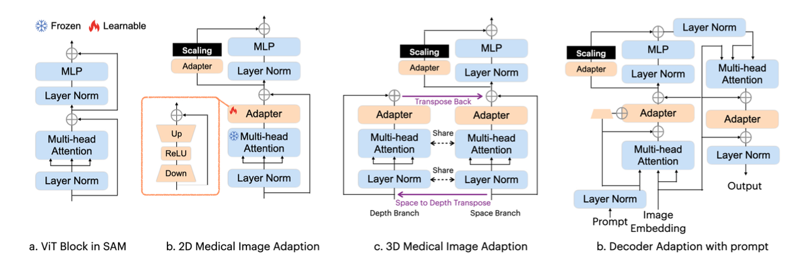

> paper: [https://arxiv.org/pdf/2304.12620](https://arxiv.org/pdf/2304.12620)
> code: [https://github.com/WuJunde/Medical-SAM-Adapter](https://github.com/WuJunde/Medical-SAM-Adapter)
> introduction: [https://mp.weixin.qq.com/s/ykEbDt_6lm9muKTDs6evHQ](https://mp.weixin.qq.com/s/ykEbDt_6lm9muKTDs6evHQ)

# Medical SAM Adapter: Adapting Segment Anything Model for Medical Image Segmentation

## Abstract
背景：SAM在医疗领域效果不好
实现：加入Med SAM Adapter
效果：很好

## Introduction
prompt-based medical image segmentation
Adaption 是指使用一种[[PEFT]]技术微调预训练过的SAM模型

## Method
