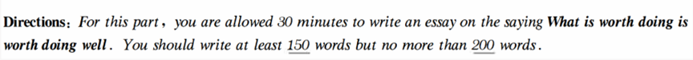

# 段落结构划分
- 三个段落（10-11句）
	- 第一段（2-3句）
		- 前1-2句提出你的问题（你对这个问题的看法是什么，好还是不好，应不应该这样做）
		 - 第3句过渡句
	- 第二段（6个句子）
		- 3个论点和3个论据
	- 第三段2句：  
		- 第一句：重申观点。To sum up, ......
		- 第二句万能结尾（提出期望）

- 第一段
	- 现象解释/观点选择/问题解决/谚语类/图画
- 第二段
	- 论点1
		- In the first place, there is no doubt that...
	- 论据1
		- Based on big data, most of ___ admitted that ___ (they've spent 2/3 of their time in doing sth.)
	- 论点2
		- Moreover, no one can deny that...
	- 论据2
		- where there is/are _________ , there is/are ___ 
	- 论点3
		- Last but not least, I firmly believe that...
	- 论据3
		- Although, ...
- 第三段
	- In conclusion, ___ . If we spare no efforts to ___ ,the future of ___ will be both hopeful and rosy.
# 议论文

## 现象解释
关键词：**what, why**

```
In the contemporary world, _______(主题词) have/has become increasingly important. It's of great necessity for___to______. Reasons and concrete evidence to support my view point are as follows.
In the first place,there is no doubt that_________________Based on big data, most of _______ admitted that________(they've spent 2/3 of their time in doing sth.) Moreover，no one can deny that___________________.where there is/are__________________, there is/are______.Last but not least, I firmly believe that_________. The more responsibilities you have, the more repay you will get.越......， 越........
In conclusion, ___________.If we spare no efforts to_______, the future of _______ will be both hopeful and rosy.

```

表原因：
- The multifaceted reasons supporting my viewpoint on (prioritizing confidence) are as follows.


## 观点选择
关键词：**choice**


## 问题解决
关键词：**how to, measure, solution**


# 图片和图表
关键词：**image，cartoon，diagram，chart**

# 范文
## 谚语类
What is worth doing is worth doing well.



范文1
As an old saying goes: What is worth doing, worth doing well. For us college students, it has an increasingly important significance: If you want to achieve something, you need a serious attitude. The following reasons can account for this issue.

In the first place,there is no doubt that we can’t divorce from the reality that attitude plays an important role in one’s success. Based on big data, most successful social elites admitted that they have a serious mindset towards everything. Moreover, no one can deny that a serious attitude makes us stronger. Where there is serious spirit, there are opportunities. Last but not least, I firmly believe that without a serious attitude, we can’t make any achievements.(If we don’t have the serious mindset, we can’t do anything.) The more serious you are, the more possibility you will succeed .

In conclusion, the serious attitude towards everything is essential for everyone.If we spare no effort to（不遗余力） cultivate this mindset, the future of our study and career will be both hopeful and rosy.

范文2
When it comes to any task, it is important to ensure that it is done to the best of our abilities. “What’s worth doing, is worth doing well” is a popular saying that speaks to this idea. It encourages us to give our all to any task that is worth doing, or important to us. To do so, we must be dedicated, organized and focused on achieving the best results.

This saying is a reminder that hard work and dedication will pay off. It is a lesson that can be applied to our professional and personal lives. It emphasizes the importance of striving for excellence, regardless of the task at hand. This can be done by taking the time to learn a skill, researching the task and understanding the outcomes you want.

In summary, this saying is a reminder that if we are going to do something, we should do it to the best of our abilities. We should strive for excellence, not just in our work, but in all aspects of life, no matter how big or small the task is. This will bring rewards in the long run and ensure that we are truly proud of the results.


# 话题
## 重要
- play an important role in one's development
## 有利于
- Positive psychological suggestion is conducive to the cultivation of confidence
- 
## 充足
- ample preparation
- sufficient
## 趋势
- a trend that reflects the growing awareness of the importance of self-assurance in both academic and personal life.
- ever-competitive academic environment
- the evolving landscape of career opportunities
## 好处
 - enables students to tackle challenges, engage in new experiences, and pursue their goals with determination
 - navigating the complexities of online personas and real-world interactions
 - a response to the increasing awareness of mental health
 - promotes mental well-being
 - confidence will remain an invaluable asset for the youth, empowering them to achieve their full potential.

## 影响

influence=impact=effect=implication
have/exert a strong/profound/far-reaching/outsized influence on sb.
褒义：have/exert a salutary/beneficial/favorable effect on
贬义：have/impose devastating/adverse/detrimental/harmful effect on
have repercussion for 间接的不好的影响

## 优点/缺点

优点：advantage=benefit=strength=merit=virtue=positive
缺点：disadvantage=shortcoming=drawback=defect=flaw=demerit
错误：mistake=fault=error

## 能力

ability to do = capacity for = competence of = capability of = knack of/for

## 方法

- way to do =way of doing sth.
- a means of doing sth
- method of doing 系统性的方法
- approach to doing


- difference=distinction=gap
- awareness=consciousness
- trend=tendency=inclination
- environment=surroundings
- (financial/family/domestic/personal/social) circumstance=atmosphere=ambience
- occupation=profession=niche(comfortable/suitable job)=career
- get = obtain = acquire = gain
- use=utilize=take advantage of=make use of


## 压力

pressure=stress=tension=strain
**cause** stress/tension/strain
**cope with/deal with/handle** the pressure/stress/tension/strain
to **relieve/ease** the pressure/stress/tension/strain
to be **suffering from** stress/tension
to be **under** pressure/stress/strain
**considerable** pressure/stress/tension/strain

## 认为

think = reckon = argue that = deem = be firmly convinced that

## 提高

improve=enhance=boost=promote=ameliorate（情况）

## 阻碍

impede=hinder=hamper=obstruct


