---
categories:
  - 编程语言
  - vhdl
---
# vhdl

## 标识符

合法的标识符：
A,fft and_ 4 max 2 uc

非法的标识符：
21A, fft and 4 max 2 uc a b ab_

> 第一个字符必须是字母；
> 下画线不能开头与结尾；
> 不允许连续 2 个下画线；
> 最长 32 个字符，不区分大小写 (‘ 内的字符、
> 内的字符串除外 ))，不能和 VHDL 的保留字相同；
> 字符‘ Z’ 、字符串“ ZZZZ” 的大写有特殊意义。
> 存盘文件名应与设计的实体名相同。

## VHDL模型的基本结构

vhdl语言

- 参数部分－－库、程序包(library)
- 接口部分（可视）－－设计实体(entity)
- 描述部分（功能）－－结构体(architecture)

### 库的调用、说明

库(Library)：存放公用数据类型，共 5 大类

语法：

```vhdl
LIBRARY 库名；
USE.库名.程序包名.项目名(all);
```

最常用IEEE库：

```vhdl
LIBRARY IEEE;
USE IEEE.STD_LOGIC_1164.ALL;--定义标准逻辑数据类型及其逻辑运算函数
USE IEEE.STD_LOGIC_UNSIGNED.ALL;--调用无符号数、标准逻辑与整数之间的算术、比较函数
USE IEEE.STD_LOGIC_ARITH.ALL;--定义标准逻辑的算术运算函数
```

### 实体说明

实体：描述系统的输入、输出端口。

语法：

```vhdl
ENTITY 实体名 IS
    PORT(端口表说明)；
END 实体名；   
```

端口声明：

```vhdl
PORT(
	端口名称：端口模式 数据类型；
    ...
);
```

```vhdl
ENTITY mux21a IS
    PORT(a,b:IN BIT;
        s:IN BIT;
        y:OUT BIT);
END mux21a;
```

注意：

实体名必须与文件名相同，否则无法编译。

实体名不能用中文，也不能用数字、下划线开头。

端口模式：

| 方向定义 | 含义 |
| -------- | ---- |
| IN       | 输入 |
| OUT      | 输出 |
| INOUT    | 双向 |
| BUFFER   | 输出 |

### 数据类型

指端口上流动的数据的表达格式。应为预先定义好数据类型。用户可自己定义。 VHDL是强数据类型语言。

bit 位逻辑型（只能取 '0' 或 '1'）。
bit_vector 位逻辑矢量型（'0011'）。
std_logic 标准逻辑型（取 '0' 、 '1' 、 'Z' 等 9 值逻辑)
std_logic_vector 标准矢量型("ZZZZ")
integer:要对具体的整数作出范围限定，否则无法综合成硬件电路。不能使用逻辑操作符。

如：`signal s : integer range 15 downto 0`;

### 结构体

语法：

```vhdl
ARCHITECTURE 结构体名 OF 实体名 IS
    [说明语句]内部信号、常数、元件、数据类型等的说明；
BEGIN
    [并行处理语句]；（行为描述、数据流描述、结构化描述）
END 结构体名；
```

```VHDL
LIBRARY IEEE;
USE IEEE.STD_LOGIC_1164.ALL;

ENTITY simp IS
    PORT(
    	a,b,c,d:in std_logic;
        g:out std_logic
    );
END simp;
    
ARCHITECTURE act OF simp IS
    SIGNAL e,f:std_logic;
BEGIN
    e< =a or b;
	f< =not(c or d);
	g< =e and f;
END act;
```


## VHDL的数据对象、操作符

### 数据对象

#### 三种对象：

1. 常量(CONSTANT)：固定值（电源、地）
2. 变量(VARIABLE)：暂时数据的局部存储（算法描述）
3. 信号(SIGNAL)：代表实际连线

#### 对象的说明格式：

`对象类型 标识符:数据类型[:=初值];`

`constant num : integer :=6;`

注意！常数定义的同时进行赋初值。

`signal s4：STD_LOGIC_VECTOR（7 DOWNTO 0）`

`signal s1：STD LOGIC;` 

`variable b,c:INTEGER range 0 to 10; `

`constant data bit_vector（3 downto 0）：="1010"`

#### 三种数据对象的特点及说明场合：

- 信号： 全局量， 在 architecture 说明区中声明。
- 变量： 局部量 。只能在 process 说明区中声明，只能用于 process 中。
- 常量： 全局量，可用于上面两种场合。

#### 数据对象的赋值：

- Constant：在程序中不能被赋值
- Variable：“:=”赋值后立即变化为新值，无延迟。
- Signal：“<=”，先改变驱动值，但不立即更新赋值，有延退。

赋值原则：相同位宽、相同数据类型

### VDHL操作符

#### 逻辑操作符（应用于 bit std_logic 类型）

6种： and 、 or 、 nand 、 nor 、 xor 、 not

要求：
1) 操作数类型、宽度必须相同，可为 bit, bit_vector, std_logic, std_logic_vector
2) 无优先级，要用括号。
X <= ( a and b ) or ( not c and d )

#### 关系操作符

（＝、 /＝用于任何数据类型，其他用于整数、枚举类型、逻辑矢量）

6种：=、/=、<、<=、>、>=

返回boolean值

#### 算术运算符

（除&外，都用于 integer 类型）

`+ - * / &`

并置操作符& 连接多个操作数，形成一个新的逻辑矢量。

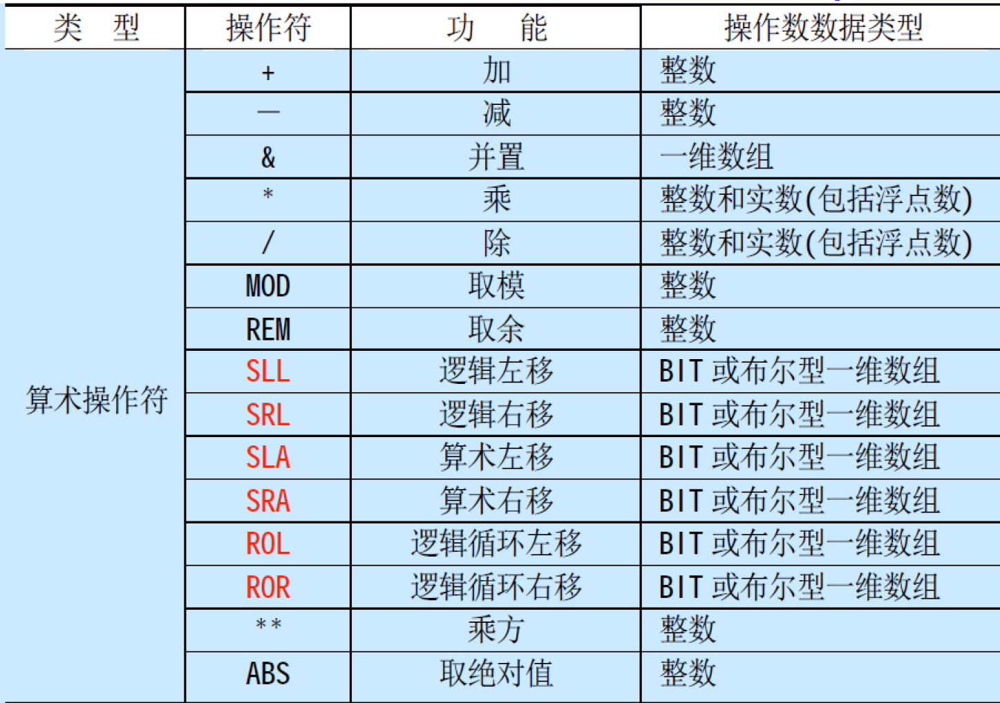

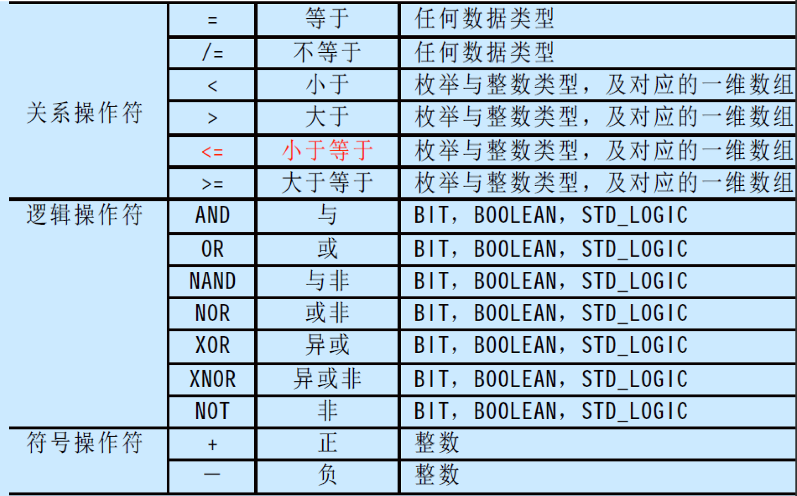

#### 重载操作符

重载操作符：
对已存在的操作符重新定义，使其能进行不同类型操作数之间的运算。通过调用一系列重载函数实现。

重载操作符的定义在IEEE库的程序包中：
std_logic_unsigned
std_logic_arith
std_logic_signed

```vhdl
LIBRARY IEEE;
USE IEEE.STD_LOGIC_1164.ALL;
USE IEEE.STD_LOGIC_UNSIGNED.ALL;

ENTITY overload IS
    PORT(
    	a:in std_logic_vector(3 downto 0);
    	b:in std_logic_vector(3 downto 0);
    	c:in integer range 0 to 15;
    	sum1:out std_logic_vector(4 downto 0);
    	sum2:out std_logic_vector(4 downto 0));
END overload;

ARCHITECTURE example OF overload IS
BEGIN
    sum1 < = ('0'&a)+b;
    sum2 < = ('0'&a)+c;
END example;
```

四位二进制全加器

```vhdl
LIBRARY IEEE;
USE IEEE.STD_LOGIC_1164.ALL;
USE IEEE.STD_LOGIC_UNSIGNED.ALL;

ENTITY add IS 
    PORT(
    	a,b:in std_logic_vector(3 downto 0);
    	c:in std_logic;
    	sum:out std_logic_vector(4 downto 0));
END add;
    
ARCHITECTURE arc OF add IS
BEGIN
    sum < = ('0'&a)+b+c;
END arc;
```


## VHDL的行为描述

行为描述语句：

- 并发(Concurrent)描述语句：硬件并行特点
- 顺序(Sequential)描述语句：描述逻辑关系、算法

### VHDL的并行语句

描述硬件最基本的本质特性——并行行为

- 赋值语句（简单、选择、条件）
- 进程语句（process）
- 例化语句（component）

进程行为之间并行关系，进程内部是顺序行为。

#### 赋值语句

特点：

- 执行与书写顺序无关
- 每一个赋值相当于一个进程

**（1）简单并行赋值**

```c
信号 < = 表达式
```

赋值的原则：相同位宽，相同数据类型

**（2）选择赋值 with-select-when**

```vhdl
WITH 选择表达式 SELECT
信号名 < = 表达式1 WHEN 选择值1，
          表达式2 WHEN 选择值2，
    
          表达式n WHEN others;
```

不能有重叠的条件分支。
最后条件为 others 。选择值必须覆盖所有取值可能。
没有优先级判断。
只能描述简单的组合逻辑。

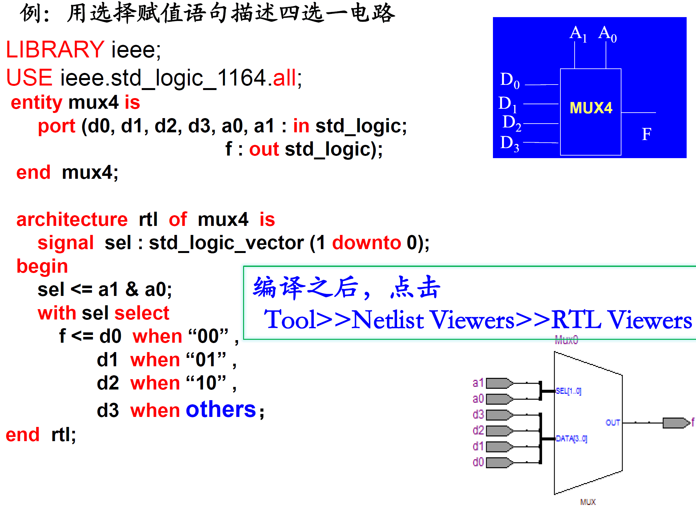

**（3）条件赋值when-else**

```vhdl
信号名< =表达式1 WHEN 条件式1 ELSE
        表达式2 WHEN 条件式2 ELSE
            
        表达式n;
```

最后的 Else 项是必须的 ;
有优先级逻辑关系，先判断第一条件；
类似 if （在 process 中使用）的嵌套语句；
只能描述简单的组合逻辑。

83优先编码器

```vhdl
library ieee;
use ieee.std_logic_1164.all;

entity coder is
    port(
    	I:in std_logic_vector(7 downto 0);
    	A:out std_logic_vector(2 downto 0));
end coder;
    
architecture rtl of coder is
begin
    A<="000" when I(7)
end rtl;
```


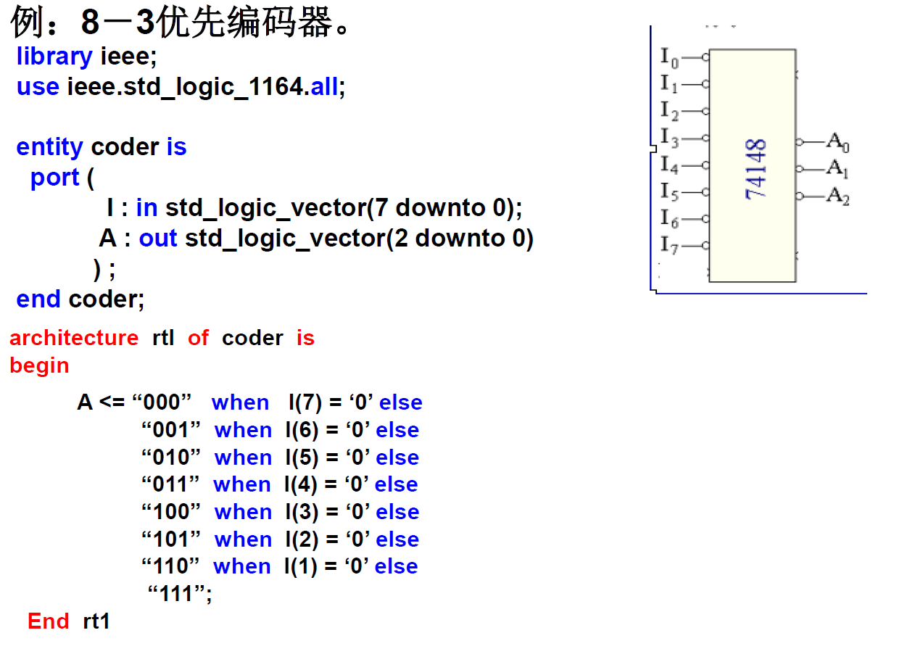

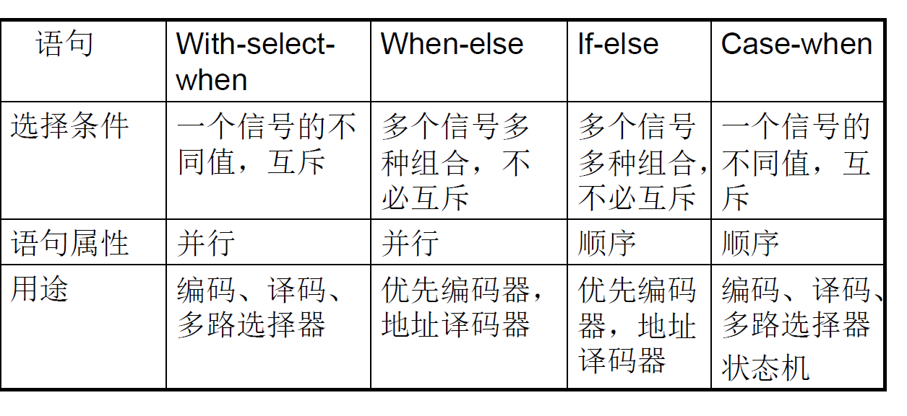

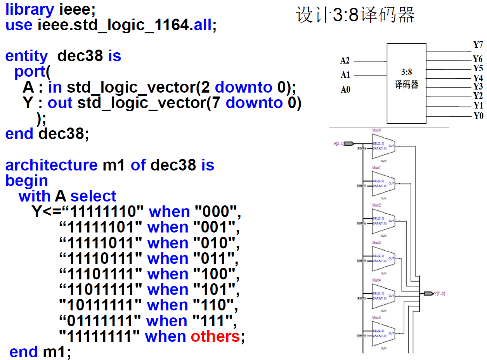

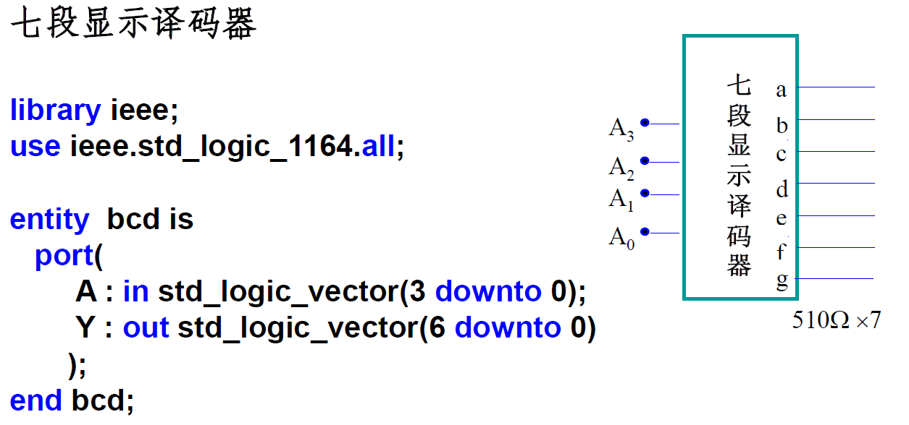

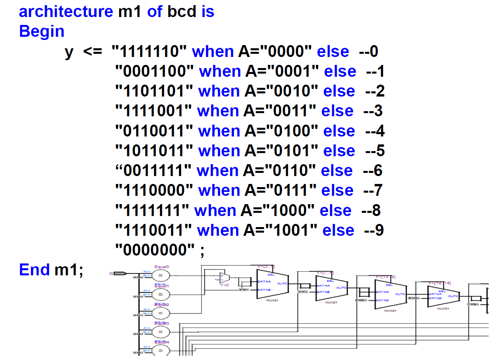

#### 进程语句

提供了一种用算法描述硬件行为的方法。几个进程语句之间是并行行为。外部并行，内部顺序。

```vhdl
PROCESS(敏感信号表)
    [变量说明语句];
BEGIN
    顺序说明语句;
END PROCESS;
```

敏感信号表：

- 进程中要读取的信号
- 敏感信号的变化都将启动进程
- 组合逻辑中，所有输入都作为敏感信号

**一个简单并行信号赋值语句是一个进程的缩写。**

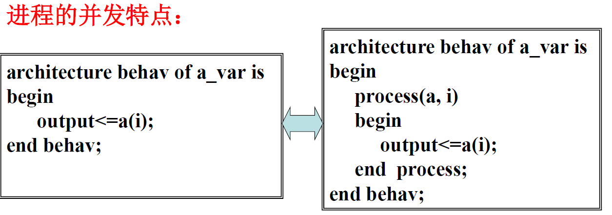

### 顺序语句

执行顺序与书写顺序一致。只能出现在进程（ process）和子程序中。描述逻辑关系，具体算法（类似 C）

- 赋值语句
- If then else
- Case is when 
- For loop

#### 简单顺序赋值

赋值对象：变量、信号

语法格式

`信号<=表达式;`

`变量:=表达式;`

赋值的原则：相同位宽，相同数据类型

**变量赋值和信号赋值的差异：**

- 硬件实现的功能不同
  - 信号：实际的硬件连线；
  - 变量：电路单元内部的操作，代表暂存的临时数据。
- 赋值行为的不同
  - 信号赋值：延迟更新数值；
  - 变量赋值：立即更新数值。
- 信号的多次赋值
  - a.一个进程：最后一次赋值有效
  - b.多个进程：多源驱动  线与、线或、三态总线

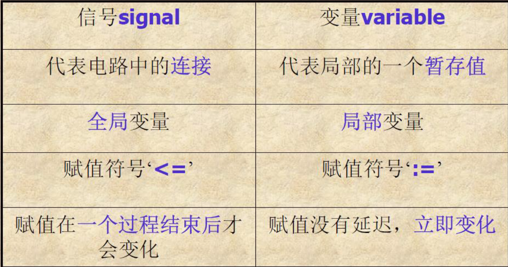

#### 转向控制语句

通过条件控制决定是否执行一条或几条语句，或重新执行一条或几条语句，仿真时顺序进行。

if/case/loop 必须在process

##### if语句

```vhdl
if 条件式 then
    顺序处理语句;
end if;
```

对于不完全的if语句，VHDL综合器将引进一个时序元件保持当前状态值。用于锁存器或触发器。

```vhdl
if 条件表达式1 then
    顺序语句;
elsif 条件表达式2 then
    顺序语句;
elsif
    ...;
else
    顺序语句;
end if;
```

if_then_elsif 语句中最先出现的条件优先级最高（自上而下优先）。
可以有多个elsif,但只能有一个else（组合逻辑）。

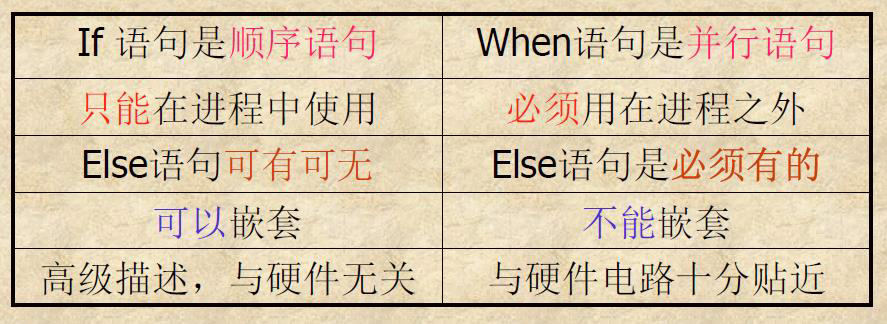

**组合逻辑一定有else，否则综合为锁存器。**

##### case语句

CASE语句根据某个表达式的值来选择执行体。 无优先级

```vhdl
CASE 选址表达式 IS
    WHEN 分支值1=>顺序处理语句;
	WHEN 分支值1=>顺序处理语句;
	WHEN OTHERS=>顺序处理语句;
END CASE;
```

分支条件须在表达式范围内，且不能重合。
执行时必须选中且只能选中一个分支。
所有值必须列举穷尽，对 sted_logic 等必须用 others 。

##### 循环语句

```vhdl
FOR 循环变量 IN 循环范围 LOOP
    顺序处理语句;
END LOOP;
```

循环变量是 loop 内部自动声明的局部量，仅在loop 内可用；
循环范围为可计算的整数范围： m (小)to n(大)

## VHDL语言的描述风格

- 行为描述：使用功能描述
- 数据流（寄存器传输）：使用布尔代数式描述
- 结构描述：模块间的连接关系描述

### 组合电路

原则1 在 process 中用到的所有输入信号都出现在敏感信号列表中；
原则2 电路的真值表必须在代码中完整的反映出来。否则会生成锁存器
原则3 使用 if·· else·· ，必须在完全互斥。

指定大写"Z"表示高阻态

### 时序电路

触发器、寄存器、计数器、分频器、节拍发生器、状态机等。

进程的敏感信号是时钟信号，在进程内部用if 语句描述时钟的边沿条件。

时钟上升沿：`(clock’event and clock = ‘1’)`

时钟下降沿：`(clock’event and clock = ‘0’)`

#### 敏感信号表的特点

1）敏感信号表中只有时钟信号－－同步复位等。

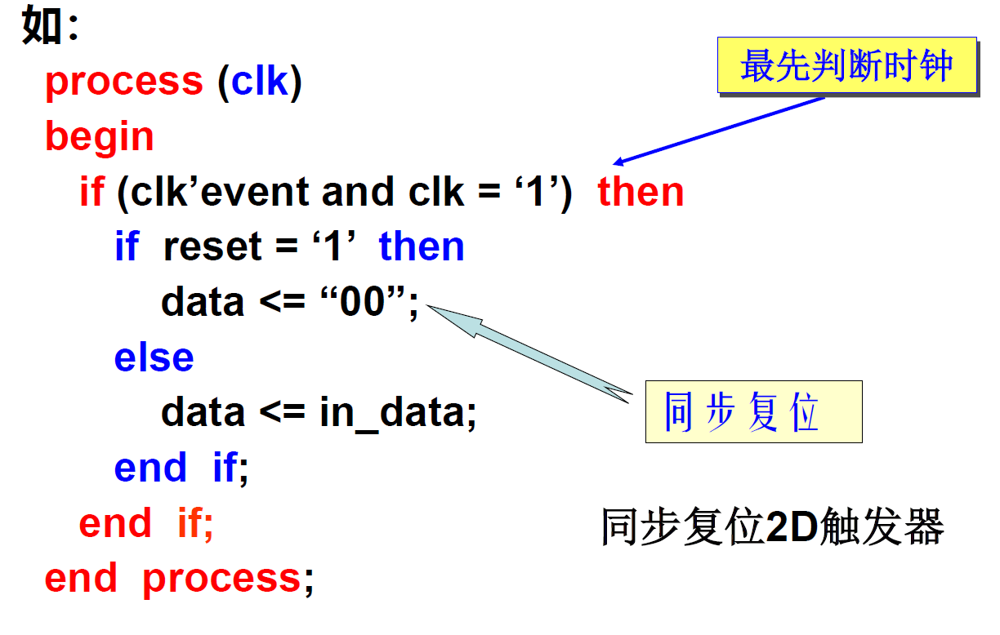

2)敏感信号表中除时钟外，还有其它信号－－异步操作

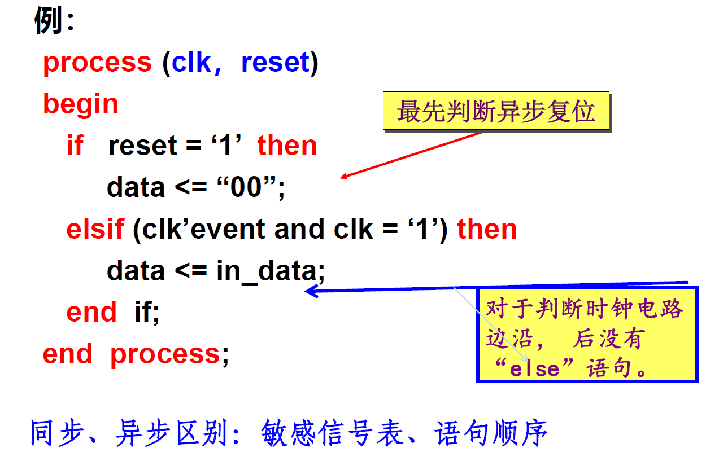

#### 计数器

描述计数器(std_logic_ vector)，要用到中间信号和标准的程序包：` IEEE.STD_LOGIC_UNSIGNED`

#### 状态机

用户自定义数据类型

利用用户自定义数据类型－－枚举类型实现。

`type 数据类型名 is 数据类型定义（枚举）`

状态转移的描述

```vhdl
CASE 现态 IS
    WHEN 表达式值=>顺序处理语句;
	WHEN 表达式值=>顺序处理语句;
END CASE;
```

状态机整体描述结构和输出的描述

组合进程：描述状态逻辑、输出逻辑

时序进程：描述从次态到现态转换；

两段式有限状态机

**Moore型状态机的描述**

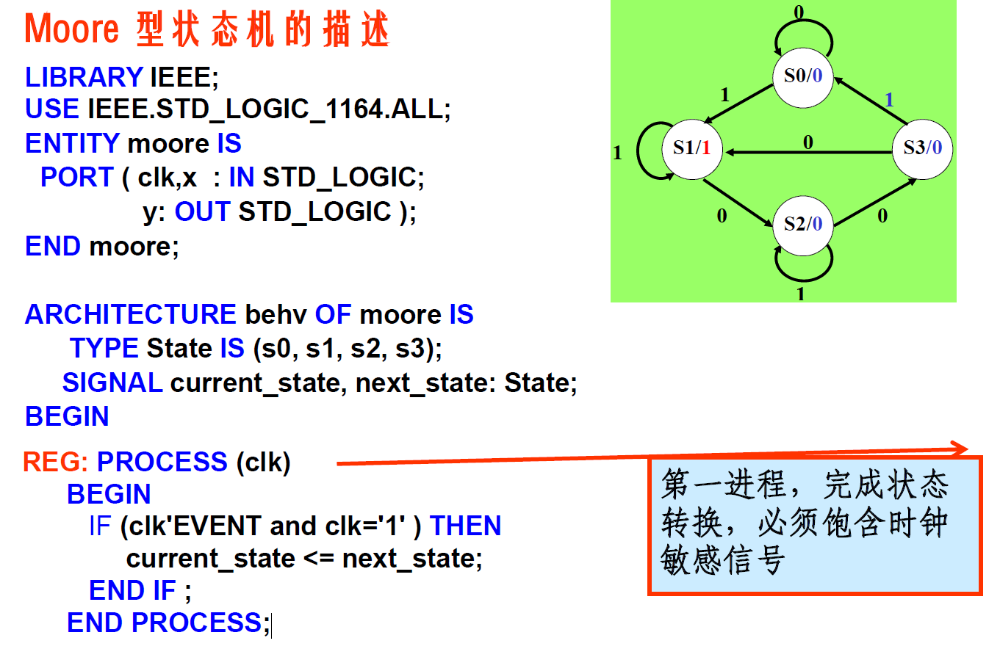

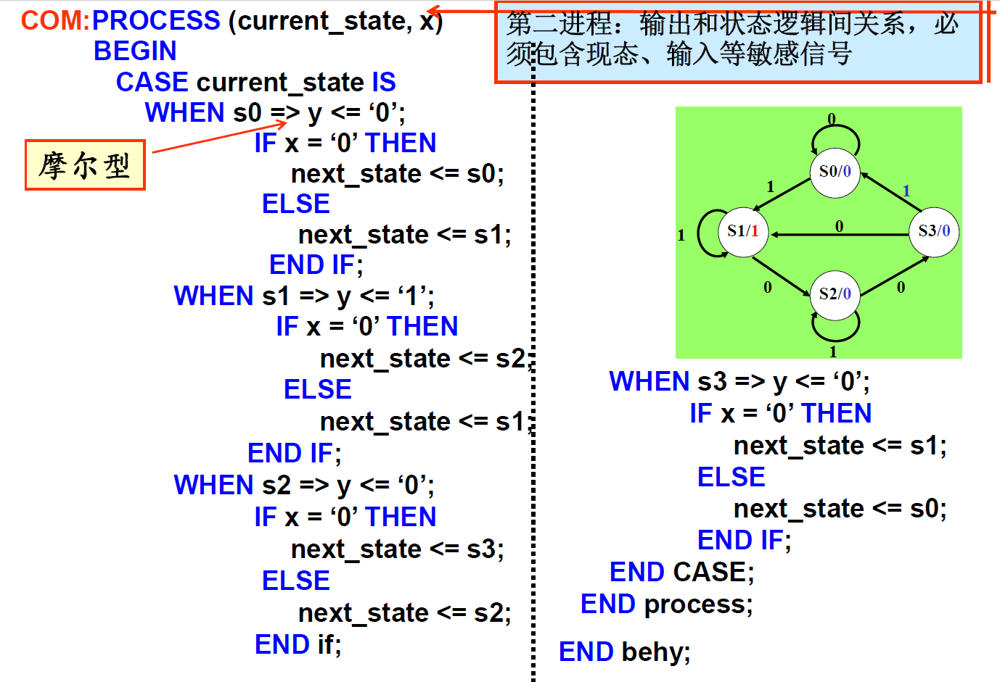

**Mealy型状态机的描述**

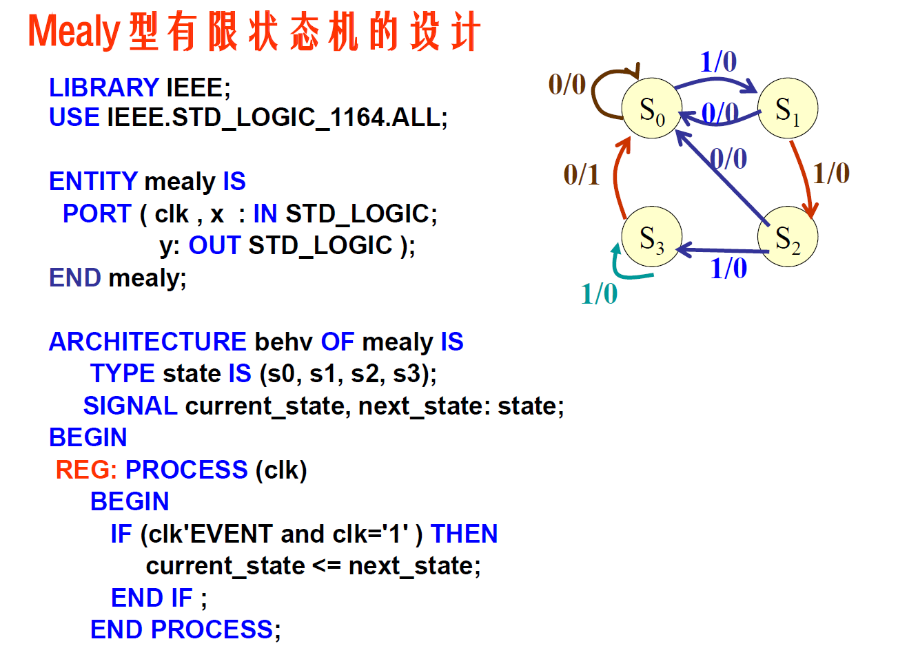

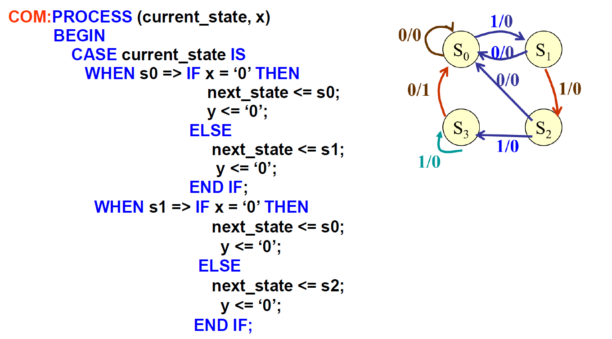

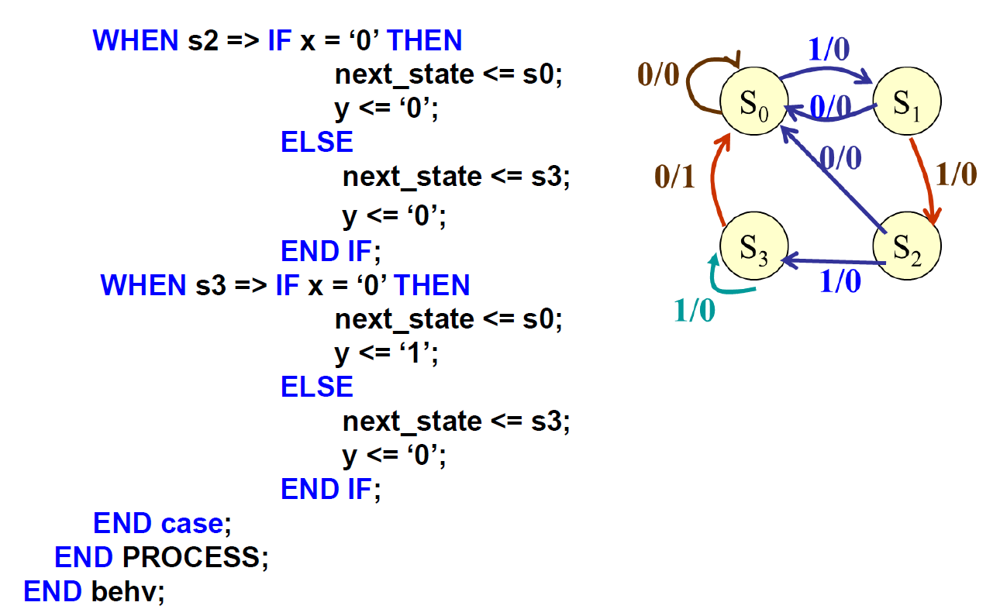


## VHDL的层次化（结构化）设计与元件例化（component）语句

在多层次的设计中，高层次的设计模块调用低层次的设计模块，构成模块化的设计。重点描述模块间的连接关系。(跟函数类似)

**由元件声明、元件例化两部分关键语句组成。**

1. 元件声明： 在结构体说明区中对所调用的低层次的实体模块（名称、端口类型等）声明为元件。

   ```vhdl
   COMPONENT 元件名
       port（端口名称）;
   END COMPONENT;
   ```

2. 元件例化： 将低层次元件调用 、 安装到当前层次 ，给出连接映射 。

   ```vhdl
   低层元件名 PORT MAP(端口列表);
   
   端口列表：低层端口名=>当前名称
   ```

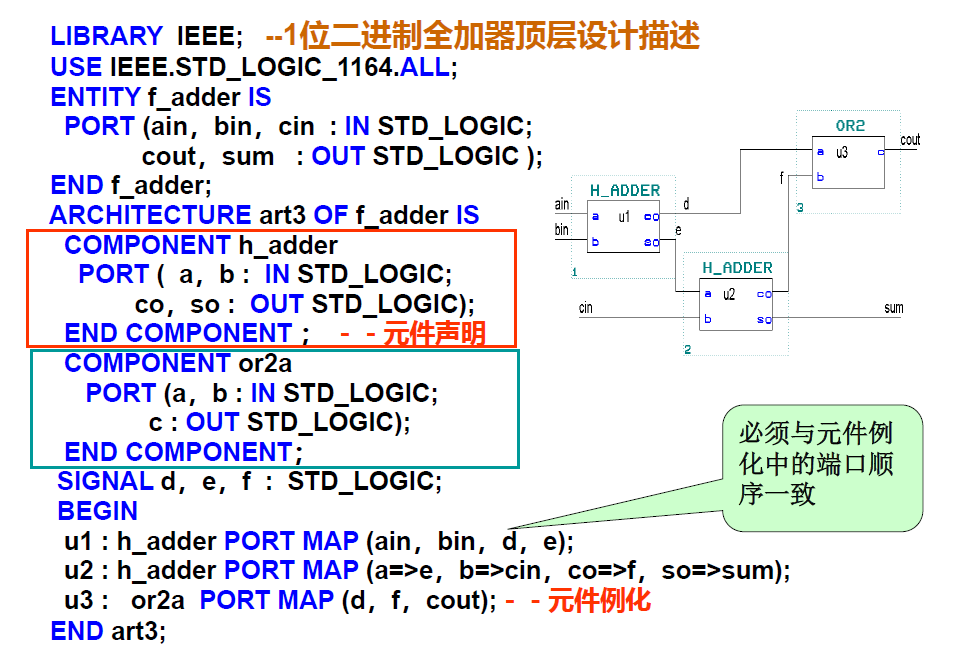

```vhdl
LIBRARY IEEE;
USE IEEE.STD_LOGIC_1164.ALL;

ENTITY rshift IS
	PORT(
		d,clk:in std_logic;
		q:out std_logic
	);
END rshift;

ARCHITECTURE act OF rshift IS
	COMPONENT shift_reg
		PORT(
			d_reg,clk_reg:in std_logic;
			q_reg:out std_logic);
	END COMPONENT;
	signal q0,q1,q2:std_logic;
BEGIN
	u0:shift_reg port map(d,clk,q0);
	u1:shift_reg port map(q0,clk,q1);
	u2:shift_reg port map(q1,clk,q2);
	u3:shift_reg port map(q2,clk,q);
END act;
```


## 例子

### 四位二进制全加器

```vhdl
LIBRARY IEEE;
USE IEEE.STD_LOGIC_1164.ALL;
USE IEEE.STD_LOGIC_UNSIGNED.ALL;

ENTITY add IS 
    PORT(
    	a,b:in std_logic_vector(3 downto 0);
    	c:in std_logic;
    	sum:out std_logic_vector(4 downto 0));
END add;
    
ARCHITECTURE arc OF add IS
BEGIN
    sum < = ('0'&a)+b+c;
END arc;
```

### 四位数据选择器

```vhdl
LIBRARY IEEE;
USE IEEE.STD_LOGIC_1164.ALL;

ENTITY mux4 IS
    PORT(
    	d0,d1,d2,d3,a0,a1:in std_logic;
    	f:out std_logic);
END mux4;
    
ARCHITECTURE rtl OF mux4 IS
    signal sel:std_logic_vector(1 downto 0);
BEGIN
    sel<=a1&a0;
	with sel select
        f<= d0 when "00",
        	d1 when "01",
        	d2 when "10",
        	d3 when others;
END rtl;
```

### 8-3优先编码器

```vhdl
LIBRARY IEEE;
USE IEEE.STD_LOGIC_1164.ALL;

ENTITY coder IS
    port(
    	I:IN SRD_LOGIC_VECTOR(7 DOWNTO 0);
    	A:OUT STD_LOGIC_VECTOR(2 DOWNTO 0));
END coder;
    
ARCHITECTURE rtl OF coder IS
BEGIN
    A<="000" WHEN I(7)='0' ELSE
        "001" WHEN I(6)='0' ELSE
        "010" WHEN I(5)='0' ELSE
        "011" WHEN I(4)='0' ELSE
        "100" WHEN I(3)='0' ELSE
        "101" WHEN I(2)='0' ELSE
        "110" WHEN I(1)='0' ELSE
        "111";
END rtl;
```

### 38译码器

```vhdl
LIBRARY IEEE;
USE IEEE.STD_LOGIC_1164.ALL;

ENTITY decode38 IS
	PORT (a2,a1,a0:IN STD_LOGIC;
	y: BUFFER STD_LOGIC_VECTOR(7 downto 0));
END decode38;

ARCHITECTURE d OF decode38 IS
	signal a:STD_LOGIC_vector(2 downto 0);
BEGIN 
	a<=a2&a1&a0;
	WITH a SELECT
	y<="00000001" when "000",
		"00000010" when "001",
		"00000100" when "010",
		"00001000" when "011",
		"00010000" when "100",
		"00100000" when "101",
		"01000000" when "110",
		"10000000" when "111";
	
END d;
```

### 有使能端的38译码器

```vhdl
LIBRARY IEEE;
USE IEEE.STD_LOGIC_1164.ALL;

ENTITY decode38 IS
	port(
		A:in std_logic_vector(2 downto 0);
		G1,G2A,G2B:in std_logic;
		Y:out std_logic_vector(7 downto 0)
	);
END decode38;

ARCHITECTURE arc OF decode38 IS
BEGIN
	PROCESS(A,G1,G2A,G2B)
	BEGIN
	IF G1='1' and G2A='0' and G2B='0' then
		CASE A IS
			WHEN "000" => Y<="11111110";
			WHEN "001" => Y<="11111101";
			WHEN "010" => Y<="11111011";
			WHEN "011" => Y<="11110111";
			WHEN "100" => Y<="11101111";
			WHEN "101" => Y<="11011111";
			WHEN "110" => Y<="10111111";
			WHEN OTHERS => Y<="01111111";
		END CASE;
	else
		Y<="11111111";
	end if;
	END PROCESS;
END arc;
```

### 七段显示译码器

```vhdl
library ieee;
use ieee.std_logic_1164.all;
entity bcd is
    PORT(A:IN STD_LOGIC_VECTOR(3 DOWNTO 0);
        Y:OUT STD_LOGIC_VECTOR(6 DOWNTO 0)
        );
end bcd;
    
ARCHITECTURE m1 OF bcd IS
BEGIN
    y<="1111110" when A="0000" else
        "0001100" when A="0001" ELSE
        "1101101" WHEN A="0010" ELSE
        "1111001" WHEN A="0011" ELSE
        "0110011" WHEN A="0100" ELSE
        "1011011" WHEN A="0101" ELSE
        "0011111" WHEN A="0110" ELSE
        "1110000" WHEN A="0111" ELSE
        "1111111" WHEN A="1000" ELSE
        "1110011" WHEN A="1001" ELSE
        "0000000";
END m1;
```

### 奇偶校验器

```vhdl
LIBRARY IEEE;
USE IEEE.STD_LOGIC_1164.ALL;

entity ParityCheck is
	port(
        a:in std_logic_vector(9 downto 0);
        even,odd:out std_logic);
end ParityCheck;

ARCHITECTURE arc OF ParityCheck is
begin
	process(a)
    	variable tmp:std_logic;
    begin
		tmp:=1;
		for n in 0 to 8 loop
            tmp:=tmp xor a(n);
		end loop;
		odd<=tmp;
		even <= NOT tmp;
    end process;
end arc;	
```

### 8位锁存器

```vhdl
LIBRARY IEEE;
USE IEEE.STD_LOGIC_1164.ALL;

ENTITY LS373 IS
	PORT(
		OE,LE:IN STD_LOGIC;
		D:IN STD_LOGIC_VECTOR(7 DOWNTO 0);
		Q:OUT STD_LOGIC_VECTOR(7 DOWNTO 0)
	);
END LS373;

ARCHITECTURE act OF LS373 IS
BEGIN
	PROCESS(OE,LE,D)
	BEGIN
		IF OE='1' THEN
			Q<="ZZZZZZZZ";
		ELSIF LE='1' THEN
			Q<=D;
		END IF;
	END PROCESS;
END act;
```

### D触发器

```vhdl
LIBRARY IEEE;
USE IEEE.STD_LOGIC_1164.ALL;

ENTITY LS374 IS
	PORT(
			CLK,OE:IN STD_LOGIC;
			D:IN STD_LOGIC_VECTOR(7 downto 0);
			Q:OUT STD_LOGIC_VECTOR(7 downto 0)
			);
END LS374;

ARCHITECTURE arc OF LS374 IS
BEGIN 
	PROCESS(CLK,OE,D)
	BEGIN
		IF OE='1' THEN
			Q<="ZZZZZZZZ";
		ELSE
			IF (CLK'event and CLK='1') THEN
				Q<=D;
			END IF;
		END IF;
	END PROCESS;
END arc;
```

### 十进制计数器的七段显示译码

```vhdl
LIBRARY IEEE;
USE IEEE.STD_LOGIC_1164.ALL;
USE IEEE.STD_LOGIC_UNSIGNED.ALL;

ENTITY count10 IS
PORT(
	CLK,CLR:IN STD_LOGIC;
	Y:OUT STD_LOGIC_VECTOR(6 DOWNTO 0)
);
END count10;

ARCHITECTURE act OF count10 IS
	SIGNAL Q:STD_LOGIC_VECTOR(3 DOWNTO 0);
	SIGNAL temp:STD_LOGIC_VECTOR(3 DOWNTO 0);
BEGIN
	PROCESS(CLK,CLR)
	BEGIN
		IF(CLR='0')THEN
			temp<="0000";
		ELSIF(CLK'EVENT AND CLK='1') THEN
			IF(temp="1001") THEN
				temp<="0000";
			ELSE
				temp<=temp+1;
			END IF;
		END IF;
	END PROCESS;
	Q<=temp;
	PROCESS(Q)
	BEGIN
		CASE Q IS
			WHEN "0000"=>Y<="1111110";
			WHEN "0001"=>Y<="0110000";
			WHEN "0010"=>Y<="1101101";
			WHEN "0011"=>Y<="1111001";
			WHEN "0100"=>Y<="0110011";
			WHEN "0101"=>Y<="1011011";
			WHEN "0110"=>Y<="0011111";
			WHEN "0111"=>Y<="1110000";
			WHEN "1000"=>Y<="1111111";
			WHEN "1001"=>Y<="1110011";
			WHEN OTHERS=>Y<="0000000";
		END CASE;
	END PROCESS;
END act;
```

### 六十进制计数器的七段显示译码

```vhdl
LIBRARY IEEE;
USE IEEE.STD_LOGIC_1164.ALL;
USE IEEE.STD_LOGIC_UNSIGNED.ALL; 

ENTITY counter60 IS
Port ( 
	clk : in std_logic;
	clr : in std_logic;
	y1 : out std_logic_vector(6 downto 0);
	y2 : out std_logic_vector(6 downto 0)
);
END counter60;             

architecture art of counter60 is    
	signal s1_temp : std_logic_vector(3 downto 0); 
	signal s10_temp : std_logic_vector(2 downto 0); 
begin
	process (clk, clr) 
	begin
		if (clr='1') then  
			s1_temp <= "0000";
			s10_temp <= "000";
		elsif (clk'event and clk= '1') then
			if (s1_temp= 9) then  
				s1_temp<= "0000";
				if (s10_temp = 5) then
					s10_temp<= "000";
				else
					s10_temp <= s10_temp+1;   
				end if;
			else
				s1_temp <= s1_temp+1;   
			end if; 
		end if;
	end process;  
	 
	y1<= "1111110" when s1_temp="0000" else
		"0001100" when s1_temp="0001" else
		"1101101" when s1_temp="0010" else
		"1111001" when s1_temp="0011" else 
		"0110011" when s1_temp="0100" else
		"1011011" when s1_temp="0101" else
		"0011111" when s1_temp="0110" else
		"1110000" when s1_temp="0111" else
		"1111111" when s1_temp="1000" else
		"1110011" when s1_temp="1001" else
		"0000000";
		
	y2<= "1111110" when s10_temp="000" else
		"0001100" when s10_temp="001" else 
		"1101101" when s10_temp="010" else
		"1111001" when s10_temp="011" else
		"0110011" when s10_temp="000" else
		"1011011" when s10_temp="101" else 
		"0000000";  
end art;
```

### 十进制计数器

```vhdl
LIBRARY IEEE;
USE IEEE.STD_LOGIC_1164.ALL;

ENTITY counter10 IS 
    PORT(
    	CLK,CLR:IN STD_LOGIC;
    	LOAD:IN STD_LOGIC;
    	DIN:IN STD_LOGIC_VECTOR(3 DOWNTO 0);
    	QOUT:OUT STD_LOGIC_VECTOR(3 DOWNTO 0);
    	C:OUT STD_LOGIC);
END counter10;
    
ARCHITECTURE act OF counter10 IS
    signal temp:std_logic_vector(3 downto 0);
BEGIN
    process(CLK,CLR,LOAD,DIN)
    begin
        IF CLR='0' THEN
            temp<="0000";
        ELSIF CLK'EVENT AND CLK='1' THEN
            IF LOAD='0' THEN
                temp<=DIN;
            ELSIF temp="1001" THEN
                temp<="0000";
            ELSE
                temp<=temp+1;
            END IF;
        END IF;
    end process;
    QOUT <= temp;
    if(temp="1001") then
        C<='1';
END act;
```

### 状态机

```vhdl
LIBRARY IEEE;
USE IEEE.STD_LOGIC_1164.ALL;

ENTITY machine IS 
	port(
		clk,x:in std_logic;
		qout:out std_logic_vector(1 downto 0)
	);
END machine;

ARCHITECTURE act OF machine IS
	TYPE state IS (s0,s1,s2,s3);
	SIGNAL current_state,next_state:state;
BEGIN
	REG:PROCESS(clk)
	BEGIN
		IF (clk'event and clk='1') THEN
			current_state<=next_state;
		END IF;
	END PROCESS;
	COM:PROCESS(current_state,x)
	BEGIN
		CASE current_state IS 
		WHEN s0=>qout<="00";
			IF x='0' THEN
				next_state<=s1;
			ELSE
				next_state<=s0;
			END IF;
		WHEN s1=>qout<="01";
			IF x='1' THEN
				next_state<=s2;
			ELSE
				next_state<=s1;
			END IF;
		WHEN s2=>qout<="10";
			IF x='0' THEN
				next_state<=s3;
			ELSE
				next_state<=s2;
			END IF;
		WHEN s3=>qout<="11";
			IF x='1' THEN
				next_state<=s0;
			ELSE
				next_state<=s3;
			END IF;
		END CASE;
	END PROCESS;
END act;
```

### 八进制计数器

```vhdl
LIBRARY IEEE;
USE IEEE.STD_LOGIC_1164.ALL;

ENTITY counter8 IS
	port(
		clk,y:in std_logic;
		qout:out std_logic_vector(2 downto 0)
	);
END counter8;

ARCHITECTURE act OF counter8 IS
	TYPE state IS (s0,s1,s2,s3,s4,s5,s6,s7);
	SIGNAL current_state,next_state:state;
BEGIN
	PROCESS(clk)
	BEGIN
		IF(clk'event and clk='1')THEN
			current_state<=next_state;
		END IF;
	END PROCESS;
	
	PROCESS(current_state,y)
	BEGIN
		CASE current_state IS
			WHEN s0=>qout<="000";
					IF y='1' THEN 
						next_state<=s1;
					ELSE
						next_state<=s7;
					END IF;
			WHEN s1=>qout<="001";
					IF y='1' THEN 
						next_state<=s2;
					ELSE
						next_state<=s0;
					END IF;
			WHEN s2=>qout<="011";
					IF y='1' THEN 
						next_state<=s3;
					ELSE
						next_state<=s1;
					END IF;
			WHEN s3=>qout<="010";
					IF y='1' THEN 
						next_state<=s4;
					ELSE
						next_state<=s2;
					END IF;
			WHEN s4=>qout<="110";
					IF y='1' THEN 
						next_state<=s5;
					ELSE
						next_state<=s3;
					END IF;
			WHEN s5=>qout<="111";
					IF y='1' THEN 
						next_state<=s6;
					ELSE
						next_state<=s4;
					END IF;
			WHEN s6=>qout<="101";
					IF y='1' THEN 
						next_state<=s7;
					ELSE
						next_state<=s5;
					END IF;
			WHEN s7=>qout<="100";
					IF y='1' THEN 
						next_state<=s0;
					ELSE
						next_state<=s6;
					END IF;
		END CASE;
	END PROCESS;

END act;
```


