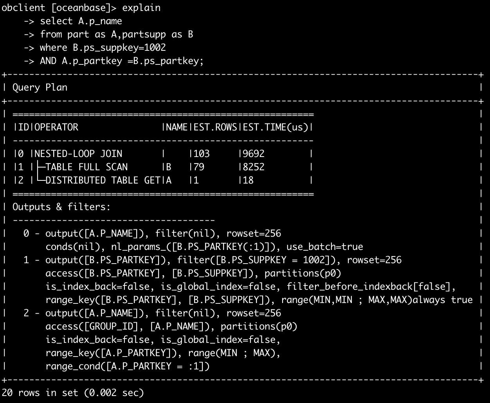
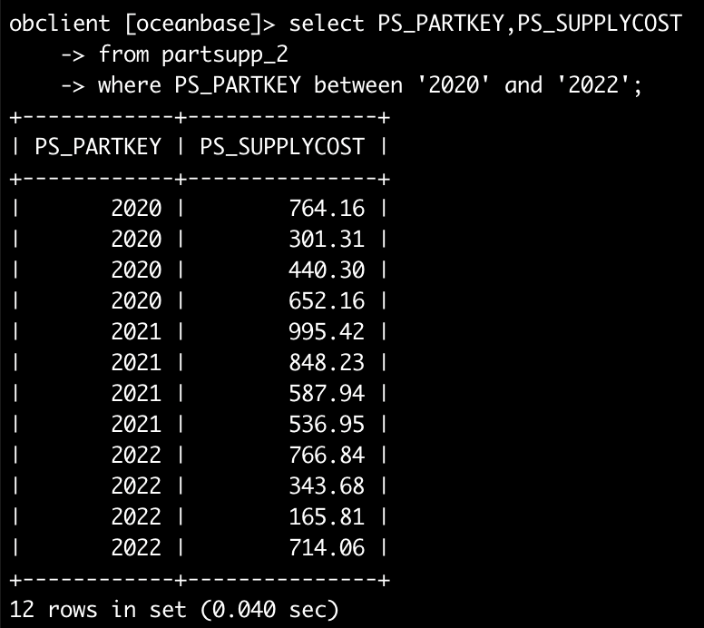

<center></center>

<center><font size="20"><b>《数据库系统原理》</b></font></center>
<center><font size="20"><b>课程实验报告</b></font></center>


<center></center>

 


​      


<center><font size="4" face="华文仿宋">学  院：<u>计算机学院（国家示范性软件学院）</u></font></center>        

<center><font size="4" face="华文仿宋">班 级：<u>&nbsp&nbsp&nbsp&nbsp&nbsp&nbsp&nbsp&nbsp&nbsp&nbsp&nbsp&nbsp&nbsp&nbsp&nbsp&nbsp&nbsp&nbsp&nbsp&nbsp&nbsp 2021211307 &nbsp&nbsp&nbsp&nbsp&nbsp&nbsp&nbsp&nbsp&nbsp&nbsp&nbsp&nbsp&nbsp&nbsp&nbsp&nbsp&nbsp&nbsp&nbsp&nbsp&nbsp</u></font></center>     

<center><font size="4" face="华文仿宋">姓 名：<u>&nbsp&nbsp&nbsp&nbsp&nbsp&nbsp&nbsp&nbsp&nbsp&nbsp&nbsp&nbsp&nbsp&nbsp&nbsp&nbsp&nbsp&nbsp&nbsp&nbsp&nbsp&nbsp&nbsp&nbsp&nbsp谢欣栩&nbsp&nbsp&nbsp&nbsp&nbsp&nbsp&nbsp&nbsp&nbsp&nbsp&nbsp&nbsp&nbsp&nbsp&nbsp&nbsp&nbsp&nbsp&nbsp&nbsp&nbsp&nbsp&nbsp&nbsp&nbsp</u></font></center>   

<center><font size="4" face="华文仿宋">学 号：<u>&nbsp&nbsp&nbsp&nbsp&nbsp&nbsp&nbsp&nbsp&nbsp&nbsp&nbsp&nbsp&nbsp&nbsp&nbsp&nbsp&nbsp&nbsp&nbsp&nbsp&nbsp 2021211336 &nbsp&nbsp&nbsp&nbsp&nbsp&nbsp&nbsp&nbsp&nbsp&nbsp&nbsp&nbsp&nbsp&nbsp&nbsp&nbsp&nbsp&nbsp&nbsp&nbsp&nbsp</u></font></center>     

 


<center><font size="4"><b>2023年12月9日</b></font></center>


<center><font size="6"><b>目录</b></font></center>

[TOC]


# 数据库系统原理课程实验

## 数据建模

### 实验目的

### 实验环境

### 实验内容

### 实验要求

### 实验步骤

### 实验总结

## 数据库安装部署与数据库实例连接和建表数据导入

### 实验目的

本实验适用于连接 OceanBase 数据库，通过该实验可以顺利完成用各种方式来连接 OceanBase 数据库。本实验主要描述如何standalone方式部署并连接到OceanBase数据库.

- 部署并连接OceanBase数据库实例

### 实验环境

VMWare Workstation+Ubuntu 22.04.3 LTS+OceanBase All in One V4.2.1_CE_BP2

### 实验内容

- 安装和部署OceanBase数据库
- 通过 OBClient 连接数据库实例，建⽴数据库和表并导⼊实验数据。

### 实验要求


### 实验步骤

#### 准备实验环境

1. 下载Ubuntu 22.04.3 LTS的镜像文件，在VMWare Workstation中新建虚拟机，配置CPU为8核，内存16GB，磁盘类型为40GB，文件系统使用EXT4或XFS。

#### 安装部署与连接OceanBase

1. 下载并安装all-in-one安装包

在https://www.oceanbase.com/softwarecenter网站上下载x86版本。


2. 单机部署OceanBase数据库


3. 安装jdk8。

在终端输入以下指令：

```bash
sudo apt-get update
sudo apt-get install openjdk-8-jdk
```

3. 使用白屏部署OceanBase

输入命令`obd web`启动白屏界面，并根据输出地址登录白屏界面开始部署。


在节点配置页面输入节点ip和用户密码。


在 集群配置 页⾯配置集群的部署模式、密码、⽬录、端⼜以及更多配置。


在 预检查 页⾯查看配置信息，⽆误后单击 预检查 进⾏检查。


部署成功。


4. 连接OceanBase数据库

- 通过 2881 端⼜直连数据库
  - obclient -h127.0.0.1 -P2881 -uroot -p'12345678' -Doceanbase -A
  - 

- 通过 ODP 代理访问数据库
  - obclient -h127.0.0.1 -P2883 -uroot -p'12345678' -Doceanbase -A
  - 

- 登录 OCP Express ⽩屏界⾯管理集群

#### 数据库建表及数据导入

1. 创建数据库并指定字符集


2. 创建表关系

每个表的关系模式如下：

1. **REGION**
   - REGION(**R_REGIONKEY**, R_NAME, R_COMMENT)

2. **NATION**
   - NATION(**N_NATIONKEY**, N_NAME, N_REGIONKEY, N_COMMENT)
   - 外键：N_REGIONKEY references REGION(R_REGIONKEY)

3. **PART**
   - PART(**P_PARTKEY**, P_NAME, P_MFGR, P_BRAND, P_TYPE, P_SIZE, P_CONTAINER, P_RETAILPRICE, P_COMMENT)

4. **SUPPLIER**
   - SUPPLIER(**S_SUPPKEY**, S_NAME, S_ADDRESS, S_NATIONKEY, S_PHONE, S_ACCTBAL, S_COMMENT)
   - 外键：S_NATIONKEY references NATION(N_NATIONKEY)

5. **PARTSUPP**
   - PARTSUPP(**PS_PARTKEY, PS_SUPPKEY**, PS_AVAILQTY, PS_SUPPLYCOST, PS_COMMENT)
   - 外键：PS_SUPPKEY references SUPPLIER(S_SUPPKEY)
   - 外键：PS_PARTKEY references PART(P_PARTKEY)

6. **CUSTOMER**
   - CUSTOMER(**C_CUSTKEY**, C_NAME, C_ADDRESS, C_NATIONKEY, C_PHONE, C_ACCTBAL, C_MKTSEGMENT, C_COMMENT)
   - 外键：C_NATIONKEY references NATION(N_NATIONKEY)

7. **LINEITEM**
   - LINEITEM(**L_ORDERKEY, L_LINENUMBER**, L_PARTKEY, L_SUPPKEY, L_QUANTITY, L_EXTENDEDPRICE, L_DISCOUNT, L_TAX, L_RETURNFLAG, L_LINESTATUS, L_SHIPDATE, L_COMMITDATE, L_RECEIPTDATE, L_SHIPINSTRUCT, L_SHIPMODE, L_COMMENT)
   - 外键：L_ORDERKEY references ORDERS(O_ORDERKEY)
   - 外键：(L_PARTKEY, L_SUPPKEY) references PARTSUPP(PS_PARTKEY, PS_SUPPKEY)

8. **ORDERS**
   - ORDERS(**O_ORDERKEY**, O_CUSTKEY, O_ORDERSTATUS, O_TOTALPRICE, O_ORDERDATE, O_ORDERPRIORITY, O_CLERK, O_SHIPPRIORITY, O_COMMENT)
   - 外键：O_CUSTKEY references CUSTOMER(C_CUSTKEY)


3. 数据导入

设置导⼊的⽂件路径。

设置系统变量 secure_file_priv，配置导⼊或导出⽂件时可以访问的路径。

通过本地 Unix Socket 连接方式连接到 OceanBase 数据库，在终端输入以下指令：

`obclient -S ~/myoceanbase/oceanbase/run/sql.sock -uroot@sys -p12345678`

设置导⼊路径为存放待导⼊数据⽂件的路径: `SET GLOBAL secure_file_priv = "/home/lorine/data";`


重新连接数据库后，使⽤ `LOAD /*+ APPEND */ DATA` 语句导⼊数据。

set ob_query_timeout=120000000;

导入region，输入`load data infile '/home/lorine/data/region.txt' into table region fields terminated by '|' lines terminated by '\n';`


导入nation，输入`load data infile '/home/lorine/data/nation.txt' into table nation fields terminated by '|' lines terminated by '\n';`


导入part，输入`load data infile '/home/lorine/data/part.txt' into table part fields terminated by '|' lines terminated by '\n';`


导入supplier，输入`load data infile '/home/lorine/data/supplier.txt' into table supplier fields terminated by '|' lines terminated by '\n';`


导入customer，输入`load data infile '/home/lorine/data/customer.txt' into table customer fields terminated by '|' lines terminated by '\n';`


导入lineitem，输入`load data infile '/home/lorine/data/lineitem.txt' into table lineitem fields terminated by '|' lines terminated by '\n';`


导入partsupp，输入`load data infile '/home/lorine/data/partsupp.txt' into table partsupp fields terminated by '|' lines terminated by '\n';`


导入orders，输入`load data infile '/home/lorine/data/orders.txt' into table orders fields terminated by '|' lines terminated by '\n';`


为关系表添加约束

```mysql
obclient [oceanbase]> ALTER TABLE REGION
    -> ADD PRIMARY KEY (R_REGIONKEY);
Query OK, 0 rows affected (2.141 sec)

obclient [oceanbase]> ALTER TABLE NATION
    -> ADD PRIMARY KEY (N_NATIONKEY);
Query OK, 0 rows affected (1.325 sec)

obclient [oceanbase]> ALTER TABLE NATION
    -> ADD FOREIGN KEY (N_REGIONKEY) references REGION(R_REGIONKEY);
Query OK, 0 rows affected (1.963 sec)

obclient [oceanbase]> ALTER TABLE PART
    -> ADD PRIMARY KEY (P_PARTKEY);
Query OK, 0 rows affected (1.941 sec)

obclient [oceanbase]> ALTER TABLE SUPPLIER
    -> ADD PRIMARY KEY (S_SUPPKEY);
Query OK, 0 rows affected (0.810 sec)

obclient [oceanbase]> ALTER TABLE SUPPLIER
    -> ADD FOREIGN KEY (S_NATIONKEY) references NATION(N_NATIONKEY);
Query OK, 0 rows affected (0.530 sec)

obclient [oceanbase]> ALTER TABLE PARTSUPP
    -> ADD PRIMARY KEY (PS_PARTKEY,PS_SUPPKEY);
Query OK, 0 rows affected (4.443 sec)

obclient [oceanbase]> ALTER TABLE CUSTOMER
    -> ADD PRIMARY KEY (C_CUSTKEY);
Query OK, 0 rows affected (1.613 sec)

obclient [oceanbase]> ALTER TABLE CUSTOMER
    -> ADD FOREIGN KEY (C_NATIONKEY) references NATION(N_NATIONKEY);
Query OK, 0 rows affected (0.590 sec)

obclient [oceanbase]> ALTER TABLE LINEITEM
    -> ADD PRIMARY KEY (L_ORDERKEY,L_LINENUMBER);
Query OK, 0 rows affected (1 min 41.911 sec)

obclient [oceanbase]> ALTER TABLE ORDERS
    -> ADD PRIMARY KEY (O_ORDERKEY);
Query OK, 0 rows affected (8.467 sec)

obclient [oceanbase]> ALTER TABLE PARTSUPP
    -> ADD FOREIGN KEY (PS_SUPPKEY) references SUPPLIER(S_SUPPKEY);
Query OK, 0 rows affected (0.938 sec)

obclient [oceanbase]> ALTER TABLE PARTSUPP
    -> ADD FOREIGN KEY (PS_PARTKEY) references PART(P_PARTKEY);
Query OK, 0 rows affected (0.978 sec)

obclient [oceanbase]> ALTER TABLE ORDERS
    -> ADD FOREIGN KEY (O_CUSTKEY) references CUSTOMER(C_CUSTKEY);
Query OK, 0 rows affected (0.687 sec)

obclient [oceanbase]> ALTER TABLE LINEITEM
    -> ADD FOREIGN KEY (L_ORDERKEY) references ORDERS(O_ORDERKEY);
Query OK, 0 rows affected (1.632 sec)

obclient [oceanbase]> ALTER TABLE LINEITEM
    -> ADD FOREIGN KEY (L_PARTKEY,L_SUPPKEY) references PARTSUPP(PS_PARTKEY,PS_SUPPKEY);
Query OK, 0 rows affected (4.477 sec)
```

⽤ select 语句查看关系表的数据样本

`select * from lineitem order by rand() limit 10;`

| L_ORDERKEY | L_PARTKEY | L_SUPPKEY | L_LINENUMBER | L_QUANTITY | L_EXTENDEDPRICE | L_DISCOUNT | L_TAX | L_RETURNFLAG | L_LINESTATUS | L_SHIPDATE |
| ---------- | --------- | --------- | ------------ | ---------- | --------------- | ---------- | ----- | ------------ | ------------ | ---------- |
| 38182      | 38781     | 1820      | 4            | 46.00      | 79109.88        | 0.01       | 0.05  | R            | F            | 2015-07-16 |
| 407141     | 36434     | 953       | 1            | 6.00       | 8222.58         | 0.08       | 0.01  | A            | F            | 2016-10-12 |
| 600613     | 14924     | 1939      | 3            | 17.00      | 31261.64        | 0.04       | 0.02  | N            | O            | 2018-06-29 |
| 510500     | 28749     | 292       | 7            | 34.00      | 57043.16        | 0.10       | 0.07  | N            | O            | 2020-01-25 |
| 740709     | 25109     | 1622      | 4            | 25.00      | 25852.50        | 0.06       | 0.01  | N            | O            | 2019-05-09 |
| 740582     | 1414      | 1915      | 3            | 25.00      | 32885.25        | 0.01       | 0.07  | N            | O            | 2019-11-10 |
| 1129414    | 6599      | 109       | 2            | 34.00      | 51190.06        | 0.02       | 0.07  | R            | F            | 2015-11-01 |
| 665539     | 27527     | 1067      | 4            | 30.00      | 43635.60        | 0.10       | 0.06  | R            | F            | 2017-09-23 |
| 584134     | 25240     | 1753      | 6            | 31.00      | 36122.44        | 0.05       | 0.01  | N            | O            | 2019-04-23 |

### 实验总结

## 数据查询与修改

### 实验目的

对前⾯实验建⽴的电商数据库关系表进⾏各种类型的查询操作和修改操作，加深对 SQL 语⾔中 DML 的了解，掌握相关查询语句和数据修改语句的使⽤⽅法。

### 实验环境

本实验环境为任意受⽀持 Linux 系统上的 OceanBase v4.2.1 数据库 ，实验数据采⽤电商数据库的⼋张表。

### 实验内容

1． 单表简单查询，包括复合选择条件、结果排序、结果去重、结果重命名查询；
2． 多表查询，包括等值连接、⾃然连接、元组变量查询；
3． 统计查询，包括带有分组、聚集函数的查询；
4． 嵌套查询，包括带有 in/some/all、 exists、unique 的嵌套查询，from 中⼦查询；
5． with 临时视图查询；
6． 键/函数依赖分析；
7． 表的插⼊、删除、更新；

### 实验要求

⽤ MySQL 语句完成以上操作。

### 实验步骤

#### 单表查询

**查询1：**从订单表ORDERS表中，找出由收银员Clerk#000000951处理的满⾜下列条件的所有订单o_orderkey：
（1）订单总价位于[50000,100000]，并且
（2）下单⽇期在2016-09-01⾄2021-09-01之间，并且
（3）订单状态 O_ORDERSTATUS 不为空，列出这些订单的订单 key（O_ORDERKEY）、客户 key、订单状态、订单总价、下单⽇期、订单优先级和发货优先级；
要求：对查询结果，按照订单优先级从⾼到低、发货优先级从⾼到低排序，并且将 O_ORDERDATE 重新命名为 O_DATE。

```sql
SELECT 
    O_ORDERKEY, 
    O_CUSTKEY, 
    O_ORDERSTATUS, 
    O_TOTALPRICE, 
    O_ORDERDATE AS O_DATE, 
    O_ORDERPRIORITY, 
    O_SHIPPRIORITY 
FROM 
    ORDERS 
WHERE 
    O_CLERK = 'Clerk#000000951' AND 
    O_TOTALPRICE BETWEEN 50000 AND 100000 AND 
    O_ORDERDATE BETWEEN '2016-09-01' AND '2021-09-01' AND 
    O_ORDERSTATUS IS NOT NULL 
ORDER BY 
    O_ORDERPRIORITY DESC, 
    O_SHIPPRIORITY DESC;
```


**查询 2：**从订单明细表 LINEITEM 表中，找出满⾜下列条件的所有订单 L_ORDERKEY：

（1）数量位于[10,30]， （2）退货标志为‘N’的订单中，价格不⼩于30000，列出这些订单的 key 和零件供应商 key、价格；

要求：对查询结果，按照价格从⾼到低排序，并且对查询结果使⽤ distinct 去重。 ⽐较对查询结果去重和不去重，在查询时间和查询结果上的差异。

```sql
SELECT DISTINCT
    L_ORDERKEY, 
    L_SUPPKEY, 
    L_EXTENDEDPRICE 
FROM 
    LINEITEM 
WHERE 
    L_QUANTITY BETWEEN 10 AND 30 AND 
    L_RETURNFLAG = 'N' AND 
    L_EXTENDEDPRICE >= 30000
ORDER BY 
    L_EXTENDEDPRICE DESC;
```

使用distinct去重的结果如下：


不使用distinct去重的结果如下：


发现使用distinct进行去重，查询结果相同，但是查询速度提升了很多。

#### String操作

**查询 3：**从客户表 CUSTOMER 表中，找出满⾜下列条件的客户： 

（1）客户电话开头部分包含‘10’，或者客户市场领域中包含“BUILDING”，并且 （2）客户电话结尾不为‘8’。

```sql
SELECT *
FROM CUSTOMER
WHERE (C_PHONE LIKE '10%' OR C_MKTSEGMENT LIKE '%BUILDING%')
  AND C_PHONE NOT LIKE '%8';
```


**查询 4：**从客户表 CUSTOMER 表中，找出满⾜下列条件的客户姓名： 

（1）客户 key 由 2 个字符组成，并且 （2）客户地址⾄少包括 18 个字符，即地址字符串的长度不⼩于 18。


#### 集合操作

**查询 5**：使⽤集合并操作 union、union all，从订单明细表 LINEITEM 查询满⾜下列条件的订单 key

(1)订单发货⽇期早于‘2016-01-01’，或者

(2)订单数量⼤于 100

对⽐ union all、union 操作在查询结果、执⾏时间上的差异。

使用union all

```sql
SELECT L_ORDERKEY 
FROM LINEITEM 
WHERE L_SHIPDATE < '2016-01-01'
UNION ALL
SELECT L_ORDERKEY 
FROM LINEITEM 
WHERE L_QUANTITY > 100;
```


使用union

```sql
SELECT L_ORDERKEY 
FROM LINEITEM 
WHERE L_SHIPDATE < '2016-01-01'
UNION
SELECT L_ORDERKEY 
FROM LINEITEM 
WHERE L_QUANTITY > 100;
```


使用union操作查询结果会少于union all，因为union all会合并两个查询结果，不去重，而union操作会进行去重。

**查询 6**：结合教材 3.4.1 节元组变量样例，使⽤集合操作 except、not exists，从供应商表 SUPPLIER 中，查 询账户余额最⼤的供应商。 对⽐使⽤ except、not exists、聚集函数 max，对⽐完成此查询在执⾏时间、查询结果上的异同。

要找出账户余额最大的供应商，我们可以使用不同的 SQL 查询方法：`EXCEPT`、`NOT EXISTS` 和聚集函数 `MAX`。每种方法都有其特点，在执行时间和查询结果上可能会有所不同。

1. 使用 EXCEPT

首先选出所有供应商的账户余额，然后从中排除那些不是最大值的余额，留下的就是最大余额的供应商。

```sql
SELECT S_SUPPKEY, S_ACCTBAL
FROM SUPPLIER
WHERE S_ACCTBAL = (SELECT MAX(S_ACCTBAL) FROM SUPPLIER);
```


2. 使用 NOT EXISTS

通过比较账户余额来查找最大值，选择那些没有比它更大余额的供应商。

```sql
SELECT S_SUPPKEY, S_ACCTBAL
FROM SUPPLIER S1
WHERE NOT EXISTS (
    SELECT 1
    FROM SUPPLIER S2
    WHERE S2.S_ACCTBAL > S1.S_ACCTBAL
);
```


3. 使用 MAX 聚集函数

```sql
SELECT S_SUPPKEY, MAX(S_ACCTBAL)
FROM SUPPLIER
GROUP BY S_SUPPKEY
ORDER BY MAX(S_ACCTBAL) DESC
LIMIT 1;
```


可以看出，查询结果相同，但执行时间有差异。使用MAX聚集函数速度最快，而EXCEPT其次，NOT EXITSTS的速度最慢。是由于MAX聚集函数直接应用了聚集函数来查找最大值，而其他两种语句涉及子查询和比较操作。

#### 多表查询

**查询 7**：选取两张数据量⽐较⼩的表 T 1 和 T2 ，如地区表 REGION、国家表 NATION、供应商表 SUPPLIER， 执⾏如下⽆连接条件的笛卡尔积操作，观察数据库系统的反应和查询结果：

```sql
SELECT *
FROM REGION, NATION;
```


结果：产生125行的结果集。

**查询 8**：使⽤多表连接操作（3.3.3 join/natural join，4.1.1 join），从订单表 ORDERS、供应商表 SUPPLIER、 订单明细表 LINEITEM 中，查询实际到达⽇期⼩于预计到达⽇期的订单，列出这些订单的订单 key、订单总价、 下单⽇期以及该供应商的姓名、地址和⼿机号。

```sql
SELECT 
    O.O_ORDERKEY, 
    O.O_TOTALPRICE, 
    O.O_ORDERDATE, 
    S.S_NAME, 
    S.S_ADDRESS, 
    S.S_PHONE
FROM 
    ORDERS O
JOIN 
    LINEITEM L ON O.O_ORDERKEY = L.L_ORDERKEY
JOIN 
    SUPPLIER S ON L.L_SUPPKEY = S.S_SUPPKEY
WHERE 
    L.L_RECEIPTDATE < L.L_COMMITDATE;
```


**查询 9**：使⽤多表连接操作，从供应商表 SUPPLIER、零部件表 PART、零部件供应表 PARTSUPP 中，查 询供应零件品牌为‘Brand#13’的供应商信息，列出零件供应数量与成本，以及供应商的姓名与⼿机号。

```sql
SELECT 
    S.S_NAME, 
    S.S_PHONE, 
    PS.PS_AVAILQTY, 
    PS.PS_SUPPLYCOST
FROM 
    SUPPLIER S
JOIN 
    PARTSUPP PS ON S.S_SUPPKEY = PS.PS_SUPPKEY
JOIN 
    PART P ON PS.PS_PARTKEY = P.P_PARTKEY
WHERE 
    P.P_BRAND = 'Brand#13';
```


**查询 10**：利⽤订单明细表 LINEITEM，使⽤教材 3.4.1 节元组变量 as/rename ⽅式，查询所有⽐流⽔号为“1”， 订单号为“1”的折扣⾼的订单 key 和流⽔号，列出这些订单的零件、折扣，结果按照折扣的降序排列。

```sql
SELECT 
    L_ORDERKEY AS OrderKey, 
    L_LINENUMBER AS LineNumber, 
    L_PARTKEY AS Part, 
    L_DISCOUNT AS Discount
FROM 
    LINEITEM
WHERE 
    L_DISCOUNT > (SELECT L_DISCOUNT 
                  FROM LINEITEM 
                  WHERE L_ORDERKEY = 1 AND L_LINENUMBER = 1)
ORDER BY 
    L_DISCOUNT DESC;
```


#### 聚集函数

**查询 11**：从订单明细表 LINEITEM、订单表 ORDERS、客户表 CUSTOMER、国家表 NATION，查询客户来⾃ ALGERIA，下单⽇期为'2015-01-01'到'2015-02-02'的订单下列信息：

（1）满⾜条件订单的最⼤数量、最⼩数量和平均数量。

（2）具有最⼤数量且满⾜上述条件的订单，列出该订单的发货⽇期、下单⽇期。

查询最大数量、最小数量和平均数量

```sql
SELECT 
    MAX(L.L_QUANTITY) AS MaxQuantity, 
    MIN(L.L_QUANTITY) AS MinQuantity, 
    AVG(L.L_QUANTITY) AS AvgQuantity
FROM 
    LINEITEM L
JOIN 
    ORDERS O ON L.L_ORDERKEY = O.O_ORDERKEY
JOIN 
    CUSTOMER C ON O.O_CUSTKEY = C.C_CUSTKEY
JOIN 
    NATION N ON C.C_NATIONKEY = N.N_NATIONKEY
WHERE 
    N.N_NAME = 'ALGERIA' AND 
    O.O_ORDERDATE BETWEEN '2015-01-01' AND '2015-02-02';
```


查询具有最大数量的订单的发货日期和下单日期

```sql
SELECT 
    L.L_SHIPDATE, 
    O.O_ORDERDATE
FROM 
    LINEITEM L
JOIN 
    ORDERS O ON L.L_ORDERKEY = O.O_ORDERKEY
JOIN 
    CUSTOMER C ON O.O_CUSTKEY = C.C_CUSTKEY
JOIN 
    NATION N ON C.C_NATIONKEY = N.N_NATIONKEY
WHERE 
    N.N_NAME = 'ALGERIA' AND 
    O.O_ORDERDATE BETWEEN '2015-01-01' AND '2015-02-02' AND
    L.L_QUANTITY = (SELECT MAX(L2.L_QUANTITY)
                    FROM LINEITEM L2
                    JOIN ORDERS O2 ON L2.L_ORDERKEY = O2.O_ORDERKEY
                    JOIN CUSTOMER C2 ON O2.O_CUSTKEY = C2.C_CUSTKEY
                    JOIN NATION N2 ON C2.C_NATIONKEY = N2.N_NATIONKEY
                    WHERE N2.N_NAME = 'ALGERIA' AND 
                    O2.O_ORDERDATE BETWEEN '2015-01-01' AND '2015-02-02');
```


**查询 12**：根据零部件表 PART 和零部件供应表 PARTSUPP 和供应商表 SUPPLIER，查询有多少零件⼚商 提供了品牌为 Brand#13 的零件，给出这些零件的类型、零售价和供应商数量，并将查询结果按照零售价降序排列。

```sql
SELECT 
    P.P_TYPE, 
    P.P_RETAILPRICE, 
    COUNT(DISTINCT PS.PS_SUPPKEY) AS SupplierCount
FROM 
    PART P
JOIN 
    PARTSUPP PS ON P.P_PARTKEY = PS.PS_PARTKEY
JOIN 
    SUPPLIER S ON PS.PS_SUPPKEY = S.S_SUPPKEY
WHERE 
    P.P_BRAND = 'Brand#13'
GROUP BY 
    P.P_TYPE, 
    P.P_RETAILPRICE
ORDER BY 
    P.P_RETAILPRICE DESC;
```


**查询 13**：从零部件表 PART 和零部件供应表 PARTSUPP 中，查询所有零件⼤⼩在[7,14]之间的零件的平均 零售价，给出零件 key，供应成本，平均零售价，结果按照零售价降序排列。

```sql
SELECT 
    P.P_PARTKEY, 
    PS.PS_SUPPLYCOST, 
    AVG(P.P_RETAILPRICE) AS AvgRetailPrice
FROM 
    PART P
JOIN 
    PARTSUPP PS ON P.P_PARTKEY = PS.PS_PARTKEY
WHERE 
    P.P_SIZE BETWEEN 7 AND 14
GROUP BY 
    P.P_PARTKEY, 
    PS.PS_SUPPLYCOST
ORDER BY 
    AvgRetailPrice DESC;
```


#### 嵌套查询

查询 14：从订单明细表 LINEITEM、订单表 ORDERS、客户表 CUSTOMER 中，使⽤ set membership 运算 符 in，查询明细折扣⼩于 0.01 的订单，列出这些订单的 key 和采购订单的客户姓名。

对⽐使⽤多表连接、⾮嵌套的查询在执⾏时间、查询结果上的异同。

1. 使用集合成员运算符 IN 的嵌套查询

```sql
SELECT 
    O.O_ORDERKEY, 
    C.C_NAME
FROM 
    ORDERS O
JOIN 
    CUSTOMER C ON O.O_CUSTKEY = C.C_CUSTKEY
WHERE 
    O.O_ORDERKEY IN (SELECT L.L_ORDERKEY 
                     FROM LINEITEM L
                     WHERE L.L_DISCOUNT < 0.01);
```


2. 使用多表连接的非嵌套查询

```sql
SELECT 
    O.O_ORDERKEY, 
    C.C_NAME
FROM 
    ORDERS O
JOIN 
    CUSTOMER C ON O.O_CUSTKEY = C.C_CUSTKEY
JOIN 
    LINEITEM L ON O.O_ORDERKEY = L.L_ORDERKEY
WHERE 
    L.L_DISCOUNT < 0.01
GROUP BY 
    O.O_ORDERKEY, 
    C.C_NAME;
```


查询 15-1：从订单明细表 LINEITEM，使⽤ Set Comparison 运算符 some，查询满⾜下列条件的订单：该订 单的数量⼤于发货⽇期在[?,?]之间的部分（⾄少⼀个）订单的数量，列出这些订单的流⽔号、key 和税。

```sql
SELECT 
    L.L_LINENUMBER, 
    L.L_ORDERKEY, 
    L.L_TAX
FROM 
    LINEITEM L
WHERE 
    L.L_QUANTITY > SOME (SELECT L2.L_QUANTITY
                          FROM LINEITEM L2
                          WHERE L2.L_SHIPDATE BETWEEN '2020-01-01' AND '2020-01-31');
```


查询 15-2：从订单表 ORDERS，使⽤ Set Comparison 运算符 some，查询满⾜下列条件的订单：订单状态 为‘O’，订单总价⼤于部分在 2020 年之后下单的订单。列出这些订单的 key、客户 key、收银员。

```sql
SELECT 
    O.O_ORDERKEY, 
    O.O_CUSTKEY, 
    O.O_CLERK
FROM 
    ORDERS O
WHERE 
    O.O_ORDERSTATUS = 'O' AND 
    O.O_TOTALPRICE > SOME (SELECT O2.O_TOTALPRICE
                            FROM ORDERS O2
                            WHERE O2.O_ORDERDATE > '2020-12-31');
```


查询 16-1：从订单明细表 LINEITEM 中，使⽤ Set Comparison 运算符>=all，查询满⾜下列条件的供应商： 该供应商在 2019 年出货量⼤于等于同时段其他供应商的出货量，即 2019 年该供应商的出货量最⾼。

```sql
SELECT 
    L.L_SUPPKEY
FROM 
    LINEITEM L
WHERE 
    L.L_SHIPDATE BETWEEN '2019-01-01' AND '2019-12-31'
GROUP BY 
    L.L_SUPPKEY
HAVING 
    SUM(L.L_QUANTITY) >= ALL (SELECT SUM(L2.L_QUANTITY)
                               FROM LINEITEM L2
                               WHERE L2.L_SHIPDATE BETWEEN '2019-01-01' AND '2019-12-31'
                               GROUP BY L2.L_SUPPKEY);
```


查询 16-2：供应商表 SUPPLIER，使⽤ Set Comparison 运算符 all，查询账户余额⼤于等于其他供应商的供 应商。列出该供应商的姓名、key、⼿机号。

```sql
SELECT 
    S.S_NAME, 
    S.S_SUPPKEY, 
    S.S_PHONE
FROM 
    SUPPLIER S
WHERE 
    S.S_ACCTBAL >= ALL (SELECT S2.S_ACCTBAL
                        FROM SUPPLIER S2
                        WHERE S2.S_SUPPKEY <> S.S_SUPPKEY);
```


查询 17-1：从供应商表 SUPPLIER、国家表 NATION，使⽤ Test for Empty Relations 运算符“exists”，查询 国家为⽇本，账户余额⼤于 5000 的供应商。

```sql
SELECT 
    S.S_SUPPKEY, 
    S.S_NAME, 
    S.S_ACCTBAL, 
    S.S_ADDRESS, 
    S.S_PHONE
FROM 
    SUPPLIER S
WHERE 
    S.S_ACCTBAL > 5000 AND
    EXISTS (SELECT 1
            FROM NATION N
            WHERE N.N_NATIONKEY = S.S_NATIONKEY AND 
                  N.N_NAME = 'JAPAN');
```


查询 17-2：从客户表 CUSTOMER、国家表 NATION、订单表 ORDERS、订单明细表 LINEITEM、供应商表 SUPPLIER 中，使⽤ Test for Empty Relations 运算符“not exists except”，查询满⾜下列条件的供应商：该供应商不能供应所有的零件。

```sql
SELECT 
    S.S_SUPPKEY,
    S.S_NAME
FROM 
    SUPPLIER S
WHERE 
    NOT EXISTS (
        SELECT 1
        FROM PART P
        WHERE NOT EXISTS (
            SELECT 1
            FROM PARTSUPP PS
            WHERE PS.PS_SUPPKEY = S.S_SUPPKEY AND PS.PS_PARTKEY = P.P_PARTKEY
        )
    );
```


查询 18：从国家表 NATION、客户表 CUSTOMER 中，使⽤“count”，查询满⾜下列条件的国家：⾄少有 3 个客户来⾃这个国家，并列出该国家的国家 key 和国家名。

```sql
SELECT 
    N.N_NATIONKEY, 
    N.N_NAME, 
    COUNT(C.C_CUSTKEY) AS CustomerCount
FROM 
    NATION N
JOIN 
    CUSTOMER C ON N.N_NATIONKEY = C.C_NATIONKEY
GROUP BY 
    N.N_NATIONKEY, 
    N.N_NAME
HAVING 
    COUNT(C.C_CUSTKEY) >= 3;
```


查询 19：从零部件表 PART 和零部件供应表 PARTSUPP 中，使⽤ Subqueries in the From Clause ⽅法，查询 满⾜下列条件的零件：零件由 2 个以上的供应商供应，且零件⼤⼩在 20 以上。

```sql
SELECT 
    P.P_PARTKEY, 
    P.P_NAME, 
    P.P_SIZE
FROM 
    PART P
JOIN (
    SELECT 
        PS.PS_PARTKEY, 
        COUNT(PS.PS_SUPPKEY) AS SupplierCount
    FROM 
        PARTSUPP PS
    GROUP BY 
        PS.PS_PARTKEY
    HAVING 
        COUNT(PS.PS_SUPPKEY) > 2
) AS SubQuery
ON P.P_PARTKEY = SubQuery.PS_PARTKEY
WHERE 
    P.P_SIZE > 20;
```


#### with 临时视图查询

查询 20：⽤ with 临时视图⽅式，实现查询 19 中查询要求。

```sql
WITH SupplierCount AS (
    SELECT 
        PS.PS_PARTKEY, 
        COUNT(PS.PS_SUPPKEY) AS SupplierNum
    FROM 
        PARTSUPP PS
    GROUP BY 
        PS.PS_PARTKEY
    HAVING 
        COUNT(PS.PS_SUPPKEY) > 2
)
SELECT 
    P.P_PARTKEY, 
    P.P_NAME, 
    P.P_SIZE
FROM 
    PART P
JOIN 
    SupplierCount ON P.P_PARTKEY = SupplierCount.PS_PARTKEY
WHERE 
    P.P_SIZE > 20;
```


查询 21：从零部件供应表 PARTSUPP 中，⽤ with 临时视图⽅式，查询零件供应数量最多的供应商 key 和 其供应的数量。

```sql
WITH TotalQuantity AS (
    SELECT 
        PS.PS_SUPPKEY, 
        SUM(PS.PS_AVAILQTY) AS TotalSupply
    FROM 
        PARTSUPP PS
    GROUP BY 
        PS.PS_SUPPKEY
)
SELECT 
    PS_SUPPKEY, 
    TotalSupply
FROM 
    TotalQuantity
ORDER BY 
    TotalSupply DESC
LIMIT 1;
```


#### 键/函数依赖分析

查询 22：在订单明细表 LINEITEM 中，检查订单 key、零件 key、供应商 key、流⽔号是否组成超键。

```sql
SELECT 
    L_ORDERKEY, 
    L_PARTKEY, 
    L_SUPPKEY, 
    L_LINENUMBER,
    COUNT(*)
FROM 
    LINEITEM
GROUP BY 
    L_ORDERKEY, 
    L_PARTKEY, 
    L_SUPPKEY, 
    L_LINENUMBER
HAVING 
    COUNT(*) > 1;
```

没有返回结果，组成了超键。

查询 23：在订单明细表 LINEITEM 中，利⽤ SQL 语句检查函数依赖零件key->价格是否成立。 利⽤ SQL 语句找出导致函数依赖不成⽴的元组。

```sql
SELECT A.L_PARTKEY, A.L_EXTENDEDPRICE AS ExtendedPriceA, B.L_EXTENDEDPRICE AS ExtendedPriceB
FROM LINEITEM A
JOIN LINEITEM B ON A.L_PARTKEY = B.L_PARTKEY
WHERE A.L_EXTENDEDPRICE <> B.L_EXTENDEDPRICE;
```

返回了35281864行，违反 L_PARTKEY 对价格函数依赖。


#### 关系表的插⼊/删除/更新

查询 24：向订单表 ORDERS 中插⼊⼀条订单数据；

```sql
INSERT INTO ORDERS 
(O_ORDERKEY, O_CUSTKEY, O_ORDERSTATUS, O_TOTALPRICE, O_ORDERDATE, O_ORDERPRIORITY, O_CLERK, O_SHIPPRIORITY, O_COMMENT)
VALUES 
(1200001, 12345, 'O', 30000.00, '2023-12-15', '3-MEDIUM', 'Clerk#000211336', 0, 'furiously special f');
```


查询 25：将零件 32 的全部供应商，作为零件 20 的供应商，加⼊到零部件供应表 PARTSUPP 中。

```sql
INSERT INTO PARTSUPP (PS_PARTKEY, PS_SUPPKEY, PS_AVAILQTY, PS_SUPPLYCOST, PS_COMMENT)
SELECT 
    20 AS PS_PARTKEY, 
    PS_SUPPKEY, 
    PS_AVAILQTY, 
    PS_SUPPLYCOST, 
    PS_COMMENT
FROM 
    PARTSUPP
WHERE 
    PS_PARTKEY = 32;
```


查询 26：在订单明细表 LINEITEM 中，删除已退货的订单记录。(returnflag='R')

```sql
DELETE FROM LINEITEM
WHERE L_RETURNFLAG = 'R';
```


查询 27：⽤订单明细表 LINEITEM 中在 2019 年之后交易中的预计到达⽇期，替换表中的实际到达⽇期。

```sql
UPDATE LINEITEM
SET L_RECEIPTDATE = L_COMMITDATE
WHERE L_SHIPDATE > '2019-12-31';
```


查询 28：针对订单明细表 LINEITEM、订单表 ORDERS，使⽤ update/case 语句做出如下修改：如果订单的 订单优先级低于 medium，则其在订单明细表中的预计到达⽇期推后 2 天, 否则推迟⼀天。

```sql
UPDATE LINEITEM
SET L_COMMITDATE = CASE 
    WHEN O.O_ORDERPRIORITY < 'medium' THEN L_COMMITDATE + INTERVAL 2 DAY
    ELSE L_COMMITDATE + INTERVAL 1 DAY
END
FROM LINEITEM L
JOIN ORDERS O ON L.L_ORDERKEY = O.O_ORDERKEY;
```


查询 29：在订单表 ORDERS 中，利⽤ Rank 函数，按照订单总价对订单进⾏降序排序，并输出订单 key 和 排名。

```sql
SELECT 
    O_ORDERKEY, 
    O_TOTALPRICE, 
    RANK() OVER (ORDER BY O_TOTALPRICE DESC) AS Rank
FROM 
    ORDERS;
```


### 实验总结

## 完整性约束

### 实验目的

了解 SQL 语⾔和 OceanBase 数据库提供的完整性（integrity）机制，通过实验掌握⾯向实际数据库建 ⽴实体完整性、参照完整性、断⾔、函数依赖等各种完整性约束的⽅法，验证各类完整性保障措施。

### 实验环境

本实验环境为任意受⽀持 Linux 系统上的 OceanBase v4.2.1 数据库 ，实验数据采⽤电商数据库的⼋张表。

### 实验内容

在前⾯完成的实验中已建⽴了本实验所需的 8 张表。本实验将针对这 8 张表，采⽤ create table、alter table 等语句，添加主键、候选键、外键、check 约束、默认/缺省值约束，并观察当⽤户对数据库进⾏ 增、删、改操作时，DBMS 如何维护完整性约束。 1． 建⽴完整性约束 2． 主键/候选键/空值/check/默认值约束验证 3． 外键/参照完整性验证分析 4． 函数依赖 5． 触发器

### 实验要求

1. 罗列的实验内容⽐较多，不必都做。类似实验内容选做有代表性的，例如， 1） 主键验证、候选键验证只做⼀个； 2） 在⼀个实验中同时验证空值、默认值、主键、check 等约束； 3） 级联、⾮级联外键约束实验⼆选⼀ 参照下⾯所给⽰例，选择电商数据库中不同的关系表，完成各个实验内容。

### 实验步骤

#### 利⽤ Create table/Alter table 语句建⽴完整性约束

1. 创建LINEITEMcopy1表，添加属性和非空

```sql
CREATE TABLE LINEITEMcopy1(
L_ORDERKEY integer NOT NULL,
L_PARTKEY integer NOT NULL,
L_SUPPKEY integer NOT NULL,
L_LINENUMBER integer NOT NULL,
L_QUANTITY DECIMAL(15,2) NOT NULL,
L_EXTENDEDPRICE DECIMAL(15,2) NOT NULL,
L_DISCOUNT DECIMAL(15,2) NOT NULL,
L_TAX DECIMAL(15,2) NOT NULL,
L_RETURNFLAG CHAR(1) NOT NULL,
L_LINESTATUS CHAR(1) NOT NULL,
L_SHIPDATE DATE NOT NULL,
L_COMMITDATE DATE NOT NULL,
L_RECEIPTDATE DATE NOT NULL,
L_SHIPINSTRUCT CHAR(25) NOT NULL,
L_SHIPMODE CHAR(10) NOT NULL,
L_COMMENT VARCHAR(44) NOT NULL,
PRIMARY KEY (L_ORDERKEY, L_LINENUMBER),
FOREIGN KEY (L_PARTKEY) REFERENCES PART(P_PARTKEY),
FOREIGN KEY (L_SUPPKEY) REFERENCES SUPPLIER(S_SUPPKEY)
);
```

2. 创建LINEITEMcopy2

```sql
CREATE TABLE LINEITEMcopy2 (
    L_ORDERKEY integer NOT NULL,
    L_PARTKEY integer NOT NULL,
    L_SUPPKEY integer NOT NULL,
    L_LINENUMBER integer NOT NULL,
    L_QUANTITY DECIMAL(15,2) NOT NULL,
    L_EXTENDEDPRICE DECIMAL(15,2) NOT NULL,
    L_DISCOUNT DECIMAL(15,2) NOT NULL,
    L_TAX DECIMAL(15,2) NOT NULL,
    L_RETURNFLAG CHAR(1) NOT NULL,
    L_LINESTATUS CHAR(1) NOT NULL,
    L_SHIPDATE DATE NOT NULL,
    L_COMMITDATE DATE NOT NULL,
    L_RECEIPTDATE DATE NOT NULL,
    L_SHIPINSTRUCT CHAR(25) NOT NULL,
    L_SHIPMODE CHAR(10) NOT NULL,
    L_COMMENT VARCHAR(44) NOT NULL
);

ALTER TABLE LINEITEMcopy2
ADD PRIMARY KEY (L_ORDERKEY, L_LINENUMBER);
ALTER TABLE LINEITEMcopy2
ADD FOREIGN KEY (L_PARTKEY) REFERENCES PART(P_PARTKEY);
ALTER TABLE LINEITEMcopy2
ADD FOREIGN KEY (L_SUPPKEY) REFERENCES SUPPLIER(S_SUPPKEY);
```

将 LINEITEM 表的数据复制到 LINEITEMcopy 表中，保证 LINEITEM 表与 LINEITEMcopy 表内容⼀致。

```sql
insert into lineitemcopy1
select *
from lineitem;

insert into lineitemcopy2
select *
from lineitem;
```

#### 主键 / 候选键 / 空值 /check/ 默认值约束验证

##### 主键 / 候选键

1. 使⽤分组聚集运算语句，判断是否满⾜主键约束，可以看出没有重复主键的数据⾏。

```sql
Select l_orderkey, count(*)
From lineitemcopy1
Group by l_orderkey, l_linenumber
Having count(*)>1;
```


结果返回0行，说明表中没有重复的数据。

2. 判断是否有主键为空的数据：

```sql
select *
from lineitemcopy1
where l_orderkey is null
and l_linenumber is null;
```


结果返回0行，说明没有主键为空的数据

3. 插入主键为空的数据，报错

```sql
INSERT INTO lineitemcopy1
values(null,0,0,null,0,0,0,0, 'a', 'b', '2020-01-01',
'2020-01-12', '2020-01-15','name3', 'name4', 'name5');
```


4. 修改原有数据⾏ l_orderkey, l_linenumber 字段为空，报错：

```sql
UPDATE lineitemcopy1
SET l_orderkey=null, l_linenumber=null
WHERE l_orderkey =1 and l_linenumber=5;
```


5. 修改原有数据⾏ l_orderkey 字段和 l_linenumber 字段与表中已有其它元组的主属性取值相同，报错

⽐如，更新表中 l_orderkey=1，l_linenumber=1 的数据⾏，将其 l_linenumber 字段值改为 2，可以看到 由于表中已经存在 l_orderkey=1，l_linenumber=2 的数据⾏，l_orderkey，l_linenumber 作为主键，不允许 重复值，因此执⾏失败。

```sql
UPDATE lineitemcopy1
SET l_linenumber =2
WHERE l_orderkey=1 and l_linenumber=1;
```


6. 插⼊主键重复的数据，报错：

```sql
INSERT INTO lineitemcopy1
values(1,0,0,2,0,0,0,0, 'a', 'b', '2020-01-01',
'2020-01-01', '2020-01-01','name3', 'name4', 'name5');
```


##### 空值

选取定义了 not null 属性约束的关系表，如 lineitemcopy1 及其属性 l_extendedprice，观察（1）向表 中插⼊新元组，或（2）修改表中已有元组时，如果导致该属性上取值为空，DBMS 的反应和处理⽅式。

1. 插⼊⼀数据⾏，其 l_extendedprice 字段为空，报错


2. 修改原有数据⾏ l_extendedprice 字段为空，报错：


#### 外键 / 参照完整性约束验证

##### 参照完整性约束验证

为⽅便起见，分别创建关系表 orders 和 customer 的副本 orderscopy 和 customercopy，并将数据导⼊进去。

```sql
CREATE TABLE customercopy2(
c_custkey integer,
c_name varchar(25),
c_address varchar(40),
c_nationkey integer,
c_phone char(15),
c_acctbal decimal(15,2),
c_mktsegment char(10),
c_comment varchar(117),
PRIMARY KEY (c_custkey),
FOREIGN KEY (c_nationkey) REFERENCES nation(n_nationkey)
);

INSERT INTO customercopy2
SELECT *
FROM customer;

CREATE TABLE orderscopy2(
o_orderkey integer,
o_custkey integer,
o_orderstatus char(1),
o_totalprice decimal(15,2),
o_orderdate date,
o_orderpriority char(15),
o_clerk char(15),
o_shippriority integer,
o_comment varchar(79),
PRIMARY KEY (o_orderkey),
FOREIGN KEY (o_custkey) REFERENCES customercopy2(c_custkey)
);

INSERT INTO orderscopy2
SELECT *
FROM orders;
```


判断两表间是否满⾜参照完整性约束


结果为0，表明两表满足参照性约束。

定义orderscopy 和 customercopy 之间的**级联关联**如下：


##### 级联/⾮级联外键关联下数据访问

建⽴好外键关联后，向 orderscopy 表中插⼊⼀⾏数据，其 O_CUSTKEY 值设为 0，由于 customercopy 表中不存在 C_CUSTKEY 值为 0 的数据⾏，违反了外键约束，因此插⼊失败：

```sql
insert into orderscopy1
values(1200002,0,'O',181580,'2019-01-02','5-LOW','Clerk#000000406',0,'special f');
```


再向 orderscopy 表中插⼊⼀⾏数据，其 O_CUSTKEY 值设为 25519，由于 customercopy 表中存在 C_CUSTKEY 值为 25519 的数据⾏，不违反外键约束，因此插⼊成功：

```sql
insert into orderscopy1
values(1200002,25519,'O',181580,'2019-01-02','5-LOW','Clerk#000000406',0,'special f');
```


向 customercopy 中插⼊⼀⾏ C_CUSTKEY 为 30001 的数据，⽽ customercopy 中不存在 C_CUSTKEY 值为 30001 的数据，插⼊成功：

```sql
INSERT INTO customercopy1
values(30001,'Customer#000030001','a',0,'10-396-325-3144',100, 'b' , 'x');
```


将 orderscopy 表中⼀⾏ O_CUSTKEY 值为 7828 的数据的 O_CUSTKEY 字段值修改为 31000，⽽ customercopy 表中并没有 C_CUSTKEY 值为 31000 的数据⾏，因此违反了外键约束，更新失败：

```sql
UPDATE orderscopy1
SET O_CUSTKEY=31000
WHERE O_CUSTKEY=7828;
```


将 orderscopy 表中⼀⾏ O_CUSTKEY 值为 8897 的数据的 O_CUSTKEY 字段值修改为 29980， customercopy 表中已有 C_CUSTKEY 值为 29980 的数据⾏，不违反外键约束，因此执⾏成功：

```sql
UPDATE orderscopy1
SET O_CUSTKEY=29980
WHERE O_CUSTKEY =8897;
```


将 customercopy 表中⼀⾏ C_CUSTKEY 值为 12 的数据的 C_CUSTKEY 字段值修改为 31001，表 orderscopy 中不存在 O_CUSTKEY 值为 12 的数据⾏,不违反外键约束，执⾏成功

```sql
UPDATE customercopy1
SET C_CUSTKEY=31001
WHERE C_CUSTKEY=12;
```


删除 orderscopy 表中 O_CUSTKEY 字段值为 17768 的数据⾏，执⾏成功：

```sql
delete from orderscopy1
where O_CUSTKEY=17768;
```


 customercopy 表中删除 C_CUSTKEY 值为 31001 的数据⾏，表 orderscopy 中不存在 C_CUSTKEY 值为 31001 的数据⾏，不违反外键约束，执⾏成功：

```sql
delete from customercopy1
where C_CUSTKEY=31001;
```


以上步骤在级联外键关联和⾮级联外键关联下都⼀样，没有本质区别。


**级联/⾮级联区别**

查看 orderscopy 表中 O_CUSTKEY=8890 的数据项

```sql
select *
from orderscopy1
where O_CUSTKEY=8890;
```


共有24条数据。

级联外键约束：

将 customercopy 表中⼀⾏ C_CUSTKEY 值为 8890 的数据的 C_CUSTKEY 字段值修改为 30005，表 orderscopy 中存在 O_CUSTKEY 值为 8890 的数据⾏,虽然违反了外键约束，但执⾏成功：


因为 orderscopy1 表中 O_CUSTKEY=30005 的数据项会跟着被删除。

查询orderscopy1表里 O_CUSTKEY=8890 的数据项，查询结果为 0 ⾏.


查询orderscopy1表里 O_CUSTKEY=300005 的数据项，查询结果为24行。


从 customercopy 表中删除 C_CUSTKEY 值为 30005 的数据⾏，表 orderscopy 中存在 O_CUSTKEY 值 为 30005 的数据⾏，虽然违反了外键约束，但执⾏成功：


因为 orderscopy 表中 O_CUSTKEY=30005 的数据项会跟着被删除


查询结果为0行。

⾮级联外键关联下的操作，只要违法了参照完整性约束，便⽆法执⾏。⽽级联外键关联下，当被参照关系中的主键发⽣修改，删除时，参照关系中的外键会跟着进⾏相应地修改，删除。


定义 orderscopy 和 customercopy 之间的⾮级联关联如下：

```sql
alter table orderscopy2
add constraint FK_O_CUSTKEY
foreign key(O_CUSTKEY) references customercopy2(C_CUSTKEY);
```


#### 函数依赖分析验证

步骤 1：判断函数依赖 P_BRAND → P_MFGR 是否满⾜。
⾸先对 P_BRAND 进⾏分组，对于有相同 P_BRAND 的元组，统计去重之后的零件⼚商数量，对于
每组结果，只要不同的零件⼚商数量⼤于 1，则说明相同的 P_BRAND 对应不同的 P_MFGR，不满⾜函
数依赖，若所有分组结果的最⼤值都为 1，则满⾜函数依赖。

```sql
select max(a) as a_MFGR
from(
select count(DISTINCT P_MFGR) as a
from part
group by P_BRAND
);
```


在分组后的每组结果中，不同的零件厂商数量都为1，所以满足函数依赖 P_BRAND → P_MFGR。

步骤 2：对于其他不满⾜依赖关系的例⼦，可以尝试找出导致该函数依赖不存在的元组。
查找导致函数依赖关系 P_BRAND → P_SIZE 不成立的元组的查询。
```SQL
select T1.P_BRAND, T1. P_SIZE, T2. P_SIZE
 from part as T1, part as T2
 where T1. P_BRAND = T2. P_BRAND
and T1. P_SIZE <> T2. P_SIZE;
```


#### 触发器约束

#### 实验1

实验 1：开发⼀个数据插⼊查重触发器，实现：
向⼀张表中插⼊⼀⾏新数据时，如果新数据的主键与表中已有其它元组的主键不相同，则直接插⼊；
如果新数据的主键与表中已有元组的主键相同，则根据新插⼊元组的属性值修改已有元组的属性值，
或者：先删除主键相同的已有元组，再插⼊新元组。


1. 创建suppliercopy1，并从supplier表中复制原数据。

```sql
CREATE TABLE suppliercopy1 (
    S_SUPPKEY INT PRIMARY KEY,
    S_NAME VARCHAR(255),
    S_ADDRESS VARCHAR(255),
    S_NATIONKEY INT,
    S_PHONE VARCHAR(20),
    S_ACCTBAL DECIMAL(10, 2),
    S_COMMENT TEXT,
    FOREIGN KEY (S_NATIONKEY) REFERENCES NATION(N_NATIONKEY)
);

INSERT INTO suppliercopy1
SELECT *
FROM supplier;
```


在表中创建一个触发器，它将执行以下逻辑：
如果新插入的数据的主键与表中已有元组的主键不相同，直接插入。
如果新插入的数据的主键与表中已有元组的主键相同，根据新插入元组的属性值修改已有元组的属性值。

```sql
DELIMITER //

CREATE PROCEDURE InsertOrUpdateSupplier(
    IN new_suppkey INT,
    IN new_name VARCHAR(255),
    IN new_address VARCHAR(255),
    IN new_nationkey INT,
    IN new_phone VARCHAR(20),
    IN new_acctbal DECIMAL(10, 2),
    IN new_comment TEXT
)
BEGIN
    DECLARE existing_key INT;
    
    -- 检查新插入的数据的主键是否已存在
    SELECT `S_SUPPKEY` INTO existing_key FROM `suppliercopy1` WHERE `S_SUPPKEY` = new_suppkey;
    
    IF existing_key IS NOT NULL THEN
        -- 如果主键已存在，执行更新操作
        UPDATE `suppliercopy1`
        SET `S_NAME` = new_name,
            `S_ADDRESS` = new_address,
            `S_NATIONKEY` = new_nationkey,
            `S_PHONE` = new_phone,
            `S_ACCTBAL` = new_acctbal,
            `S_COMMENT` = new_comment
        WHERE `S_SUPPKEY` = new_suppkey;
    ELSE
        -- 如果主键不存在，执行插入操作
        INSERT INTO `suppliercopy1` (`S_SUPPKEY`, `S_NAME`, `S_ADDRESS`, `S_NATIONKEY`, `S_PHONE`, `S_ACCTBAL`, `S_COMMENT`)
        VALUES (new_suppkey, new_name, new_address, new_nationkey, new_phone, new_acctbal, new_comment);
    END IF;
END;
//

DELIMITER ;
```


插入一条新数据，主键设置为 2001

```sql
CALL InsertOrUpdateSupplier(2001, 'Supplier#000002001', 'Address 2001', 14, '24-123-456-7890', 2500.00, 'New supplier with key 2001');
```

再插入一条数据，主键也为2001，但是S_ACCTBAL属性值不同

```sql
CALL InsertOrUpdateSupplier(2001, 'Supplier#000002001', 'Address 2001', 14, '24-123-456-7890', 3500.00, 'New supplier with key 2001');
```

查看这条数据

```sql
SELECT * FROM suppliercopy1 WHERE S_SUPPKEY = 2001;
```


##### 实验2

实验 2：开发⼀个⽇期校对触发器，实现：
当向订单明细表 LINEITEM 中插⼊⼀⾏，或者修改现有订单的发货⽇期时，判断新插⼊的、或修改 后的发货⽇期是否合法，即发货⽇期必须在预计到达⽇期和实际到达⽇期之前。如果不合法，回滚。

由于触发器中禁⽌增删改操作的嵌套使⽤，因此为了完成实验需求，再对 lineitemcopy 表进⾏⼀个备份，新表为 lineitemcopy_new.为了验证触发器正确性，删除新表上的相关约束。在实际应⽤中需保持两表 的数据⼀致性，本实验仅验证触发器效果。

```sql
CREATE TABLE lineitemcopy1_new(
L_ORDERKEY integer NOT NULL,
L_PARTKEY integer NOT NULL,
L_SUPPKEY integer NOT NULL,
L_LINENUMBER integer NOT NULL,
L_QUANTITY DECIMAL(15,2) NOT NULL,
L_EXTENDEDPRICE DECIMAL(15,2) NOT NULL,
L_DISCOUNT DECIMAL(15,2) NOT NULL,
L_TAX DECIMAL(15,2) NOT NULL,
L_RETURNFLAG CHAR(1) NOT NULL,
L_LINESTATUS CHAR(1) NOT NULL,
L_SHIPDATE DATE NOT NULL,
L_COMMITDATE DATE NOT NULL,
L_RECEIPTDATE DATE NOT NULL,
L_SHIPINSTRUCT CHAR(25) NOT NULL,
L_SHIPMODE CHAR(10) NOT NULL,
L_COMMENT VARCHAR(44) NOT NULL
);
insert into lineitemcopy1_new
select *
from lineitemcopy1;
```


创建触发器函数，将新数据插⼊到 lineitemcopy 中. 在 lineitemcopy_new 上定义插⼊触发器，如果
发货⽇期满⾜插⼊条件，则插⼊到 lineitemcopy 中，若不满⾜条件，则不进⾏插⼊操作。

```sql
DELIMITER //
CREATE TRIGGER insert_trig_before BEFORE INSERT ON lineitemcopy1_new
FOR EACH ROW
BEGIN
 IF (NEW.l_shipdate <= NEW.l_commitdate AND NEW.l_shipdate <= NEW.l_receiptdate) THEN
 INSERT INTO lineitemcopy1 (
 L_ORDERKEY, L_PARTKEY, L_SUPPKEY, L_LINENUMBER, L_QUANTITY, L_EXTENDEDPRICE,
 L_DISCOUNT, L_TAX, L_RETURNFLAG, L_LINESTATUS, L_SHIPDATE, L_COMMITDATE,
 L_RECEIPTDATE, L_SHIPINSTRUCT, L_SHIPMODE, L_COMMENT
 ) VALUES (
 NEW.L_ORDERKEY, NEW.L_PARTKEY, NEW.L_SUPPKEY, NEW.L_LINENUMBER,
NEW.L_QUANTITY,
 NEW.L_EXTENDEDPRICE, NEW.L_DISCOUNT, NEW.L_TAX, NEW.L_RETURNFLAG,
NEW.L_LINESTATUS,
 NEW.L_SHIPDATE, NEW.L_COMMITDATE, NEW.L_RECEIPTDATE, NEW.L_SHIPINSTRUCT,
NEW.L_SHIPMODE,
 NEW.L_COMMENT
 );
 END IF;
END //
DELIMITER ;
```


通过 information_schema.TRIGGERS 获取触发器定义信息。其中，`your_trigger_name`应该替换为实
际触发器名。

```sql
SELECT TRIGGER_SCHEMA, TRIGGER_NAME, EVENT_MANIPULATION, EVENT_OBJECT_TABLE,
ACTION_STATEMENT, ACTION_TIMING
FROM information_schema.TRIGGERS
WHERE TRIGGER_NAME = 'insert_trig_before';
```

 lineitemcopy_new 插⼊⼀⾏数据，发货⽇期为 2020 年 1 ⽉ 2 ⽇，预计到达⽇期和实际到达⽇期
均为 2020 年 1 ⽉ 1 ⽇，不满⾜约束条件。

```sql
INSERT INTO lineitemcopy1_new
values(4,0,0,2,0,0,0,0, 'a', 'b', '2020-01-02',
'2020-01-01', '2020-01-01','name3', 'name4', 'name5');
```

查看订单 key 为 4，流⽔号为 2 的数据⾏

```sql
select *
from lineitemcopy1_new
where l_orderkey=4 and l_linenumber=2;

select *
from lineitemcopy1
where l_orderkey=4 and l_linenumber=2;
```


发现数据插⼊到了 lineitemcopy_new 表中.

插⼊⼀⾏发货⽇期为 2020 年 1 ⽉ 2 ⽇，预计到达⽇期为 2020 年 1 ⽉ 3 ⽇，实际到达⽇期均为 2020
年 1 ⽉ 4 ⽇的数据，满⾜约束，插⼊成功。

```sql
INSERT INTO lineitemcopy1_new
values(4,1,1,3,0,0,0,0, 'a', 'b', '2020-01-02',
'2020-01-03', '2020-01-04','name3', 'name4', 'name5');
```

查看订单 key 为 4，流⽔号为 3 的数据⾏

```sql
select *
from lineitemcopy1_new
where l_orderkey=4 and l_linenumber=3;

select *
from lineitemcopy1
where l_orderkey=4 and l_linenumber=3;
```


创建触发器函数，将新数据插⼊到 lineitemcopy 中. 在 lineitemcopy_new 上定义插⼊触发器，如果 发货⽇期满⾜插⼊条件，则插⼊到 lineitemcopy 中，若不 满⾜条件，则不进⾏插⼊操作。

```sql
DELIMITER //
CREATE TRIGGER updata_trig_before BEFORE UPDATE ON lineitemcopy1_new
FOR EACH ROW
BEGIN
 IF (NEW.l_shipdate <= NEW.l_commitdate AND NEW.l_shipdate <= NEW.l_receiptdate) THEN
 UPDATE lineitemcopy1
 SET L_SHIPDATE = NEW.L_SHIPDATE
 WHERE L_ORDERKEY = NEW.L_ORDERKEY AND L_LINENUMBER = NEW.L_LINENUMBER;
 END IF;
END;
//
DELIMITER ;
```

show triggers 命令查看updata_trig_before触发器

```sql
SHOW TRIGGERS LIKE 'lineitemcopy1_new';
```

将刚才插⼊的订单 key 为 4，流⽔号为 3 的数据进⾏修改，发货⽇期新值为 2019-02-01，满⾜约束条
件。

```sql
UPDATE lineitemcopy1_new
SET l_shipdate='2019-02-01'
WHERE l_orderkey=4 and l_linenumber=3;
```


查看订单 key 为 4，流⽔号为 3 的数据⾏。两张表都更新成功。

```sql
select *
from lineitemcopy1_new
where l_orderkey=4 and l_linenumber=3;

select *
from lineitemcopy1
where l_orderkey=4 and l_linenumber=3;
```


同样的，将订单 key 为 4，流⽔号为 3 的数据再进⾏修改，PCI 新值为 2020-02-01，不满⾜约束条
件。

```sql
UPDATE lineitemcopy1_new
SET l_shipdate='2020-02-01'
WHERE l_orderkey=4 and l_linenumber=3;
```


查看订单 key 为 4，流⽔号为 3 的数据⾏，在 lineitemcopy_new 中更新成功，在 lineitemcopy 中更新失败。

```sql
select *
from lineitemcopy1_new
where l_orderkey=4 and l_linenumber=3;

select *
from lineitemcopy1
where l_orderkey=4 and l_linenumber=3;
```


### 实验总结

在实验中有哪些重要问题或者事件？你如何处理的？你的收获是什么？有何建议和意见等等。

## 数据库接口

### 实验目的

- 了解数据库应⽤程序设计采⽤的 ODBC、JDBC 两种接⼜，掌握接⼜及相关软件配置能⼒。
- 编写数据库应⽤程序，通过数据库访问接⼜访问数据库，培养数据库应⽤程序开发能⼒。

### 实验环境

本实验环境为任意受⽀持 Linux 系统上的 OceanBase v4.2.1 数据库 ，实验数据采⽤电商数据库的⼋张表

### 实验原理

动态 SQL 与数据库应⽤编程接⼜
数据库应⽤程序设计是数据库应⽤开发的⼀个重要⽅⾯。数据库系统⽤户通过两种⽅式访问数据
库：
1）直接使⽤ SQL 语句交互式访问数据库；
2）通过数据库应⽤程序，借助嵌⼊式 SQL 和⾼级程序设计语⾔，访问数据库
OceanBase ⽀持 SQL 语⾔直接访问数据库，但与⾼级程序设计语⾔（例如 C、C++、Java 等）相⽐，
SQL 语⾔数据处理能⼒较弱，因此需要将 SQL 与⾼级程序设计语⾔结合起来，利⽤ SQL 访问数据，并将
数据传递给⾼级语⾔程序进⾏处理，处理结果再利⽤ SQL 写回数据库。
这种嵌在⾼级语⾔程序中的 SQL 语句称为嵌⼊式 SQL（或者称为 ESQL），ESQL 随着应⽤程序执
⾏被调⽤，完成数据库数据读写等数据管理功能，⽽⾼级语⾔程序则负责对数据库中数据进⾏统计分析
等深层次处理。ESQL 分成两种：
1）静态 ESQL，在程序执⾏前 SQL 的结构就已经确定，但可以在执⾏时传递⼀些数值参数。
数据库系统执⾏静态 ESQL 时，⾸先利⽤预编译分离 C、C++、Java 等宿主程序语⾔中的 SQL 语
句，代之以过程或函数调⽤，然后对剩余程序正常编译和连接库函数等。分离出来的 SQL 语句则在数据
库端进⾏处理，进⾏语法检查、安全性检查和优化执⾏策略，绑定在数据库上形成包（packet）供应⽤程
序调⽤。
2）动态 ESQL，数据库应⽤程序执⾏时才确定所执⾏的 SQL 语句的结构和参数，通过数据库应⽤编
程接⼜ ODBC、JDBC 等访问数据库。
数据库系统执⾏动态 SQL 时，⽆法事先确实知道是什么样的 SQL 语句，从⽽⽆法进⾏静态绑定。这
种绑定过程只能在程序执⾏过程中⽣成了确定的要执⾏的 SQL 语句时才能进⾏，称为动态绑定。
本次实验⾯向动态 SQL，应⽤程序采⽤ ODBC、JDBC 两种接⼜访问数据库。

### 实验内容

1. 了解通⽤数据库应⽤编程接⼜（例如 JDBC、ODBC 等）的配置⽅法。
2. 利⽤ C、C++、Java 等⾼级程序设计语⾔编程实现简单的数据库应⽤程序，掌握基于 ODBC、
JDBC 接⼜的数据库访问的基本原理和⽅法，访问 LTE ⽹络数据库，执⾏查找、增加、删除、更
新等操作，掌握基于应⽤编程接⼜的数据库访问⽅法。

### 实验要求

1. 基于 JDBC 接⼜或基于 ODBC 接⼜的数据库访问实验，⼆选⼀完成⼀个即可；
2. 实验时选取 TD-LTE 数据库作为数据源，参照后⽂中的⽰例，⾃⾏设计访问 TLE ⽹络数据库访问
操作；

### 实验步骤

#### 实验准备

以课堂所学关于 SQL 语⾔相关内容为基础，课后查阅、⾃学 ODBC、JDBC 等接⼜有关内容，包括
体系结构、⼯作原理、数据访问过程、主要 API 接⼜的语法和使⽤⽅法等

#### 数据库访问接⼜环境配置

根据实验所选的应⽤编程接⼜ ODBC、JDBC，分别从不同⽹站下载接⼜驱动程序，安装配置接⼜环
境，为后续实验做准备。

1. 安装MySQL Connector/J 8.1.0：
从MySQL官方网站下载并安装MySQL Connector/J 8.1.0

前往MySQL Connector/J下载页面：https://dev.mysql.com/downloads/connector/j/
下载适用于Java 8的Connector/J 8.1.0版本。
使用命令行进入下载目录，然后执行以下命令
```bash
sudo cp mysql-connector-java-8.1.0.jar /usr/lib/jvm/java-8-openjdk-arm64/jre/lib/ext/
```
这将把Connector/J JAR文件复制到OpenJDK 8的扩展目录中。

2. 配置CLASSPATH环境变量：
配置CLASSPATH环境变量，以便Java可以找到MySQL Connector/J JAR文件。
编辑~/.bashrc 文件

```bash
nano ~/.bashrc
```

添加以下行：

```bash
export CLASSPATH=$CLASSPATH:/usr/lib/jvm/java-8-openjdk-arm64/jre/lib/ext/mysql-connector-java-8.1.0.jar
```

保存文件并在终端中执行以下命令以使更改生效：

```bash
source ~/.bashrc
```

#### 数据库连接及访问

针对 TD-LTE ⽹络配置数据库，编写 C、C++、Java 应⽤程序，通过 ODBC、JDBC 接口，连接数据
库，对数据库内容进⾏查询、插⼊、删除、更新等操作，观察记录实验结果。

编写java程序：

```java
import java.sql.Connection;
import java.sql.DriverManager;
import java.sql.ResultSet;
import java.sql.SQLException;
import java.sql.Statement;

public class OceanBase {
    /**
     * 创建数据库连接
     * @param username 数据库用户名
     * @param password 数据库密码
     * @return 返回数据库连接对象
     */
    public static Connection GetConnection(String username, String password) {
        try {
            java.lang.ClassLoader.getSystemClassLoader().loadClass("com.mysql.cj.jdbc.Driver");
            String sourceURL = "jdbc:mysql://127.0.0.1:2881/oceanbase";
            Connection conn = DriverManager.getConnection(sourceURL, username, password);
            System.out.println(conn.getAutoCommit());
            return conn;
        } catch (Exception e) {
            e.printStackTrace();
            return null;
        }
    }

    /**
     * 新建表 customer_t1
     * @param conn 数据库连接对象
     * @param sm SQL语句执行对象
     */
    public static void CreateTable(Connection conn, Statement sm) {
        try {
            sm.executeUpdate("create table customer_t1 (c_customer_sk integer, c_customer_name varchar(32))");
        } catch (Exception e) {
            e.printStackTrace();
        }
    }

    /**
     * 插入数据到表中
     * @param conn 数据库连接对象
     * @param sm SQL语句执行对象
     */
    public static void InsertData(Connection conn, Statement sm) {
        try {
            sm.executeUpdate("insert into customer_t1 values (1,1)");
        } catch (Exception e) {
            e.printStackTrace();
        }
    }

    /**
     * 更新表中的数据
     * @param conn 数据库连接对象
     * @param sm SQL语句执行对象
     */
    public static void UpdateData(Connection conn, Statement sm) {
        try {
            sm.executeUpdate("update customer_t1 set c_customer_name = 'new data' where c_customer_sk = 1");
        } catch (Exception e) {
            e.printStackTrace();
        }
    }

    /**
     * 查询数据并打印结果
     * @param conn 数据库连接对象
     * @param sm SQL语句执行对象
     */
    public static void PrintData(Connection conn, Statement sm) {
        try {
            ResultSet rs = sm.executeQuery("select * from customer_t1");
            while (rs.next()) {
                String name = rs.getString("c_customer_name");
                String id = rs.getString("c_customer_sk");
                System.out.println("name: " + name + " id: " + id);
            }
        } catch (Exception e) {
            e.printStackTrace();
        }
    }

    /**
     * 创建一个新的 SQL 语句执行对象
     * @param conn 数据库连接对象
     * @return 返回 SQL 语句执行对象
     */
    private static Statement newStatement(Connection conn) {
        try {
            Statement sm = conn.createStatement();
            return sm;
        } catch (Exception e) {
            e.printStackTrace();
            return null;
        }
    }

    /**
     * 主方法，程序入口
     * @param args 命令行参数
     */
    public static void main(String[] args) {
        try {
            Connection connection = GetConnection("root", "12345678");
            Statement sm = newStatement(connection);
            // 创建表
            CreateTable(connection, sm);
            // 插入数据
            InsertData(connection, sm);
            // 更新数据
            UpdateData(connection, sm);
            // 打印数据
            PrintData(connection, sm);
            // 关闭连接
            connection.close();
        } catch (Exception e) {
            e.printStackTrace();
        }
    }
}
```

结果显示：


### 实验总结


## 物理文件和物理设计

### 实验目的

了解数据库⽇志⽂件的类型和作⽤
能够针对⽇志⽂件进⾏⼀些简单的操作和管理维护

### 实验环境

本实验环境为任意受⽀持 Linux 系统上的 OceanBase v4.2.1 数据库，实验数据采⽤电商数据库的⼋张
表。

### 实验内容

本实验主要描述 OceanBase 数据库中⽇志管理的内容，并对数据库进⾏⽇常管理维护、问题定位和
数据库恢复的操作。

### 实验要求


### 实验步骤

#### 数据库物理文件

##### 日志概述

系统⽇志（SysLog）指 OceanBase 数据库程序⽇志，OceanBase 数据库在运⾏过程中⾃动打印的⽇
志，⽤于监控报警和诊断。系统⽇志是监控指标的有⼒补充，两者共同⽀撑起 OceanBase 数据库的可观
测能⼒。
系统⽇志与事务⽇志在有些场景下都简称为“⽇志”，但两者是完全不同的事物：
系统⽇志（SysLog）：OceanBase 数据库进程运⾏过程中打印的⽇志，⽤于监控报警和诊断，是可
观测性领域的内容。
事务⽇志（commit log，简称 clog）：OceanBase 数据库先于数据持久化的 WAL，⽤于保证事务
性，是数据⼀致性领域的内容。

##### 日志模块

程序⽇志分为不同的模块，且有⽗模块和⼦模块两个层级。
OceanBase 数据库的⽗模块包括 CLIENT、CLOG、COMMON、ELECT、LIB、PROXY、RPC、RS、SERVER、
SHARE、SQL、STORAGE、TLOG 等。
如果⽗模块下含有⼦模块，则表⽰为 ⽗模块.⼦模块。例如：SQL.PARSER，则 SQL 表⽰ SQL 模块，
SQL.PARSER 表⽰ SQL 模块下的 PARSER ⼦模块；SQL.* 表⽰ SQL 模块下的所有⼦模块。

##### 日志文件

OceanBase 数据库⽇志模块所属的⽇志⽂件分为 observer.log、election.log 和 rootservice.log
三种类型，默认打印 INFO 级别以上的⽇志。
每类⽇志⽂件⾃动⽣成⼀个带有 .wf 后缀的 WARNING ⽇志⽂件（observer.log.wf、
election.log.wf、rootservice.log.wf），只打印 WARN 级别以上的⽇志。通过集群配置项
enable_syslog_wf 控制是否⽣成 WARNING ⽇志⽂件。

OceanBase 数据库的单个⽇志⽂件⼤⼩不超过 256MB，当⽇志⽂件⼤⼩达到 256 MB 时，系统会进
⾏⽇志轮转。原⽇志⽂件追加时间为后缀（格式为 yyyyMMddHHmmss），时间为本⽇志⽂件中最后⼀条⽇
志的⽣成时间，并⽣成新的⽇志⽂件。发⽣⽇志轮转时，.wf ⽇志⽂件即使没到 256MB 也会⼀起轮
转。也就是说 xxx.log.wf ⽂件和 xxx.log ⽂件总是⼀⼀对应的，.wf ⽂件⼀般情况下远⼩于 256
MB。
典型⽇志⽂件⽬录如下：
log
├── election.log
├── election.log.wf
├── observer.log
├── observer.log.20220427154619
├── observer.log.wf
├── observer.log.wf.20220427154619
├── rootservice.log
├── rootservice.log.20220427165438
├── rootservice.log.wf
└── rootservice.log.wf.20220427165438
OceanBase 数据库原⽣⽀持⽇志归档（通过集群配置项 enable_syslog_recycle 控制），当某种⽇
志⽂件数达到 max_syslog_file_count 时，⽇志轮转时删除最⽼的⽇志⽂件。⽇志⽂件最⼤空间使⽤可
按如下⽅式评估: max_syslog_file_count * 256M * 3 * (enable_syslog_wf ? 2 : 1)。

OceanBase 数据库原⽣⽇志归档功能基于⽂件数进⾏⽇志归档，当 OceanBase 数据库与外部管控系
统（例如 OCP）⼀起部署时，通常使⽤外部管控系统提供的基于磁盘空间使⽤率的⽇志归档功能。


##### 日志格式

典型的⼀⾏⽇志，及其格式如下。
普通的⼀⾏⽇志：
```
[2022-04-29 16:39:55.186527] WARN [COMMON] get_file_id_range
(ob_log_file_group.cpp:127) [103594] [0] [Y0-0000000000000000-0-0] [lt=17]
[dc=0] max file does not exist(max_file_id=4, b_exist=false)
```
对⽇志进⾏拆解，得到⽇志格式：
```
time：[2022-04-29 16:39:55.186527]
log_level：WARN
module：[COMMON]
function：get_file_id_range
file_name:line_number：(ob_log_file_group.cpp:127)
thread_id：[103594]
coroutine_id：[0]
trace_id：[Y0-0000000000000000-0-0]
log_used_time：[lt=17]
dropped_msg_count：[dc=0]
info：max file does not exist
parameter：(max_file_id=4, b_exist=false)
⽇志格式分为两部分：
header：[2022-04-29 16:39:55.186527] WARN [COMMON] get_file_id_range
(ob_log_file_group.cpp:127) [103594] [0] [Y0-0000000000000000-0-0] [lt=17] [dc=0]
message：max file does not exist(max_file_id=4, b_exist=false)
如上格式所⽰，⼀条⽇志由头部（header）及消息体（message ）组成：
header 部分：
time：该条⽇志打印的时间。
log_level：该条⽇志的级别，⽬前⽀持以下级别（由⾼到低）：ERROR、USER_ERR、WARN、
INFO、TRACE、DEBUG。
module：当前打印⽇志的模块名，由⽗模块和⼦模块组成，OceanBase 数据库⽀持按模块指定⽇志
级别。
function：当前打印⽇志的函数名。
file_name:line_number：当前打印⽇志的代码源⽂件名以及⾏号。
thread_id：当前打印⽇志的线程 ID。
coroutine_id：当前打印⽇志的协程 ID。
trace_id：⽤于跟踪⼀个任务的 trace_id，任务级唯⼀，该 trace_id 通过 RPC 在各个 OBServer 间
传递，从⽽可以根据 trace_id 来获取⼀个任务的所有⽇志数据。对应 GV$OB_SQL_AUDIT 视图中的
TRACE_ID 字段。
log_used_time：指上⼀条⽇志的处理时间 (异步⽇志场景包含⽇志写⼊⽂件时间)。
dropped_msg_count：dc=xx，其中 xx 表⽰当前⽇志距离上⼀条⽇志期间丢弃的⽇志个数, 没有丢弃
时为 0。
message 部分：消息体⼀般由消息描述信息（info）与参数（parameter）组成。
info：具体的⽇志内容。
parameter：以 name=value 的 list 形式组成的 KV 列表。value 部分如果是简单类型直接展⽰，如
果是复杂类型则展⽰为类似于 JSON 格式的⽂本（为提⾼可读性，去掉了 JSON 格式 KEY 上的 "）。
```

##### 日志级别

1. **Error**：严重错误，必须进行故障处理，否则系统不可用；
2. **Warn**：警告，可能会出现的潜在错误；
3. **Info**：提示，系统当前运行状态，为正常信息；
4. **Trace**：与Debug相比，更细致化的事件记录信息；
5. **Debug**：调试信息，用于调试时了解系统运行状态。

OceanBase 数据库⽀持设置⽇志级别，从⽽获取更精确的⽬标⽇志。可以从三个级别设置：系统级
别、Session 级别、语句级别，打印⽇志时，优先级从⾼到低分别为语句、Session、系统。OceanBase 数
据库也⽀持按模块设置。
系统级别：作⽤范围为整个集群所有 OBServer。仅⽀持在系统租户下配置。
Session 级别：作⽤范围为当前租户在集群内所在的 OBServer。

变量设置的不同级别及其作用范围：

Session 级别的变量：仅对当前 Session 有效，对其他 Session 无效。
Global 级别的变量：对当前 Session 无效，需要重新登录建立新的 Session 才会生效。
语句级别：作用范围为当前执行语句所在的 OBServer，只在 SQL 语句执行期间有效。

可通过如下两种⽅式进⾏设置：
通过系统配置项 syslog_level 设置系统级别的⽇志级别。例如：设置 SQL 模块的⽇志级别为
debug，设置 COMMON 模块的⽇志级别为 error。
o obclient > ALTER SYSTEM SET syslog_level='sql.*:debug, common.*:error';
通过操作系统 bash kill -41/42 $pid 命令设置系统级别的⽇志级别。
kill -41 ⽤于降低程序⽇志的级别。例如：当前程序⽇志的级别为 INFO ，执⾏ kill -41 后，则
级别降低⾄ TRACE。kill -42 ⽤于升⾼程序⽇志的级别。例如：当前程序⽇志的级别为 INFO ，执⾏
kill -42 后，则级别升⾼⾄ WARN 。
推荐通过系统配置项 syslog_level 设置系统级别的⽇志级别。因为 OceanBase 数据库在刷新配置
时，会导⼊ config ⽂件（OceanBase 安装⽬录下的 etc/observer.config.bin）中配置的
syslog_level，导致 kill ⽅式失效。
注意
建议仅在 SQL 客户端登录不了 OceanBase 集群的情况下使⽤ kill -41/kill -42 调节⽇志级别。
通过 Session 级别设置⽇志模块的级别。
通过系统变量 ob_log_level 设置 Session 级别的⽇志级别。例如：设置 SQL 模块的⽇志级别为
debug，设置 COMMON 模块的⽇志级别为 info。
obclient > SET @@ob_log_level='sql.*:debug, common.*:info';
通过语句级别设置⽇志模块的级别。
可以通过 Hint 设置语句级别的⽇志级别。例如：设置 SQL 模块的⽇志级别为 debug，设置
COMMON 模块的⽇志级别为 info。更多 Hint 语句相关的介绍，请参见 Optimizer Hint。
obclient > SELECT /*+log_level('sql.*:debug, common.*:info')*/ * FROM t;

##### 审计日志

obproxy_digest.log ⽇志是审计⽇志，记录执⾏时间⼤于参数 query_digest_time_threshold 阈值
（默认 100ms，主站是 2ms）的请求和错误响应请求。默认情况下，该⽇志在安装⽬录下 obproxy/log/
⽂件夹下。例如，安装在 /opt/obdemo/ ⽬录下的数据库的审计⽇志在 /opt/obdemo/obproxy/log/ ⽂件夹
下。


##### ODP错误日志

obproxy_error.log ⽇志是 ODP 错误⽇志，执⾏错误的请求会打印到该⽇志中，包括 ODP ⾃⾝错误
和 OceanBase 数据库返回错误。
⽇志格式
⽇志打印时间,当前应⽤名,TraceId,RpcId,逻辑数据源名称,物理库信息(cluster:tenant:database),数据库类
型(OB/RDS),逻辑表名,物理表名,SQL 命令,SQL 类型(CRUD),执⾏结果(success/failed),错误码(success 时
为空),SQL,执⾏总耗时(ms),预执⾏时间,链接建⽴时间,数据库执⾏时间,当前线程名,系统穿透数据,穿透数
据,错误详情

##### Redo日志


##### 查看和设置日志级别

1. 查看日志

```sql
SHOW PARAMETERS LIKE '%syslog_level%';
```


2. 设置日志级别

	**1. 系统级别配置**
	- `ALTER SYSTEM SET syslog_level='sql.*:debug, common.*:error';`
	- `kill -41 $pid` 或 `kill -42 $pid`
	
	**2. Session 级别配置**
	- `SET @@ob_log_level='sql.*:debug, common.*:info';`
	
	**3. 语句级别配置**
	- `SELECT /*+log_level('sql.*:debug, common.*:info')*/ * FROM t;`
	
	**注意事项**
	- 在 OceanBase 数据库中，推荐通过系统配置项 `syslog_level` 设置系统级别的日志级别。当数据库刷新配置时，会导入 `observer.config.bin` 文件中配置的 `syslog_level`，可能导致使用 kill 命令的设置失效。
	- `kill -41` 和 `kill -42` 命令建议仅在无法通过 SQL 客户端登录 OceanBase 集群时使用。

3. 查看日志内容
	OceanBase 数据库的启动和运⾏⽇志为 observer.log、observer.log.wf。
	
	查看日志内容
	输入`cat observer.log`
	
	输入`cat rootservice.log`
	
##### 操作日志

登录OceanBase 集群，执⾏以下 SQL，该 SQL 会报错。
```sql
select timestamp'0001-01-33';
```


通过 GV$OB_SQL_AUDIT 视图查询该 SQL 的执⾏信息。

```sql
select * 
from gv$ob_sql_audit 
where query_sql 
like '%select timestamp%' 
limit 1\G
```


通过以上查询结果，我们可以获取到该 SQL 请求执⾏的⽬标节点及 TRACE_ID。

```
SVR_IP: 127.0.0.1
TRACE_ID: YB427F000001-00060C7B40FAC611-0-0
```

##### sql执行统计日志

obproxy_stat.log ⽇志是 SQL 执⾏统计⽇志，统计⽇志默认每分钟（由
monitor_stat_dump_interval 参数控制）输出⼀次，通过该⽇志可以查看 ODP ⼀分钟内 SQL 的执⾏
情况。
⽇志格式
```
⽇志打印时间,当前应⽤名,逻辑数据源名称,物理库信息(cluster:tenant:database),数据库类型
(OB/RDS),SQL 类型(CRUD),执⾏结果(success/failed),错误码(success 时为空),总请求数量,[30 ms, 100 ms)请求数量,[100 ms, 500 ms) 请求数量,[500 ms,+∞) 请求数量,执⾏总耗时(ms, 包括内部 SQL 执⾏耗时),预执⾏时间,数据库执⾏时间
```

⽇志⽰例
若要查看 ODP 是否有请求流量，看该⽇志记录即可，如下：


##### 慢sql请求日志

obproxy_slow.log ⽇志是慢 SQL 请求⽇志，记录执⾏时间⼤于参数 slow_query_time_threshold
阈值（默认 500ms）的请求。
⽇志格式
• ⽇志打印时间,当前应⽤名,TraceId,RpcId,逻辑数据源名称,物理库信息(cluster:tenant:database),数据
库类型(OB/RDS),逻辑表名,物理表名,SQL 命令,SQL 类型(CRUD),执⾏结果(success/failed),错误码
(success 时为空),SQL,执⾏总耗时(ms),预执⾏时间,链接建⽴时间,数据库执⾏时间,当前线程名,系统穿透数
据,穿透数据
说明：
SQL 命令 显⽰为 COM_QUERY、COM_STMT_PREPARE 等。
执⾏总耗时 包括内部 SQL 执⾏耗时。
当前线程名 显⽰ ODP 的内部线程 ID。
系统穿透数据 将显⽰系统灾备信息等。


#### 表空间

##### 分区策略
##### 创建分区表

```sql
create table partition_orders_1(
o_orderkey integer,
o_custkey integer,
o_orderstatus char(1),
o_totalprice decimal(15,2),
o_orderdate date,
o_orderpriority char(15),
o_clerk char(15),
o_shippriority integer,
o_comment varchar(79),
PRIMARY KEY (o_orderkey)
)
partition by range(o_orderkey)
(
partition p1 values less than(100),
partition p2 values less than(200),
partition p3 values less than(300),
partition p4 values less than(maxvalue)
);
```


通过如下命令查看表详情。

```sql
select * from information_schema.TABLES 
where table_schema='oceanbase' and table_name='partition_orders_1';
```


通过select命令列出各分区情况

```sql
SELECT
 TABLE_NAME AS relname,
 PARTITION_METHOD AS parttype,
 SUBPARTITION_METHOD AS subparttype,
 PARTITION_NAME AS parentid,
 PARTITION_DESCRIPTION AS boundaries
FROM
 information_schema.PARTITIONS
WHERE
 TABLE_NAME = 'partition_orders_1';
```


##### 管理分区表

删除分区

```sql
ALTER TABLE partition_orders_1 DROP PARTITION p4;
```

添加分区

```sql
ALTER TABLE partition_orders_1 ADD PARTITION (PARTITION p_4 VALUES LESS THAN(MAXVALUE));
```


修改后的分区显示如下：

```sql
SELECT
 TABLE_NAME AS relname,
 PARTITION_METHOD AS parttype,
 SUBPARTITION_METHOD AS subparttype,
 PARTITION_NAME AS parentid,
 PARTITION_DESCRIPTION AS boundaries
FROM
 information_schema.PARTITIONS
WHERE
 TABLE_NAME = 'partition_orders_1';
```


查询单独分区内的内容

```sql
SELECT select_expr_list FROM table_name PARTITION (partition_name_list) [WHERE
where_list];

SELECT * FROM partition_orders_1 PARTITION(p2);
```


数据转移

查看orders表中的数据量

```sql
select count(*) from orders;
```


将orders表中的数据转移到分区表partition_orders_1中

```sql
insert into partition_orders_1 select * from orders;
```


查看整个分区表情况，以及各分区情况

```sql
select count(*) from partition_orders_1;
```


```sql
select * from partition_orders_1;
```


```sql
select count (*) from partition_orders_1 partition(p2);
```


```sql
select * from partition_orders_1 partition(p2);
```


#### 索引

##### 局部索引

##### 全局索引

##### 普通表上创建管理索引

创建索引

创建orders表备份ordersindex，并将数据表导入

```sql
create table ordersindex(
o_orderkey integer,
o_custkey integer,
o_orderstatus char(1),
o_totalprice decimal(15,2),
o_orderdate date,
o_orderpriority char(15),
o_clerk char(15),
o_shippriority integer,
o_comment varchar(79),
PRIMARY KEY (o_orderkey)
);
INSERT INTO ordersindex
SELECT *
FROM orders;
```


创建普通索引

```sql
CREATE INDEX ordersindex_index_totalprice ON ordersindex(o_totalprice);
```


创建多字段索引

```sql
CREATE INDEX ordersindex_index_more_column 
ON ordersindex(o_orderstatus, o_totalprice);
```


管理索引

查询索引

```sql
SHOW INDEX FROM ordersindex;
```


```sql
SELECT * FROM information_schema.statistics WHERE table_schema = DATABASE();
```


查询指定索引的信息

```sql
show index from ordersindex where key_name='ordersindex_index_totalprice';
```


重命名索引

```sql
alter table ordersindex rename index ordersindex_index_more_column to
ordersindex_index_orderstatus_totalprice;
```


查看修改是否成功

```sql
show index from ordersindex
```


删除索引

```sql
alter table ordersindex drop index ordersindex_index_totalprice;
```


##### 分区表上创建管理索引

以orders表为例创建一个分区表

```sql
create table partition_orders_0(
o_orderkey integer,
o_custkey integer,
o_orderstatus char(1),
o_totalprice decimal(15,2),
o_orderdate date,
o_orderpriority char(15),
o_clerk char(15),
o_shippriority integer,
o_comment varchar(79),
PRIMARY KEY (o_orderkey)
)
partition by range(o_orderkey)
(
partition p1 values less than(100),
partition p2 values less than(200),
partition p3 values less than(300),
partition p4 values less than(maxvalue)
);
```

在o_custkey上创建分区表GLOBAL索引

```sql
create index global_index_custkey on partition_orders_0(o_custkey) global;
```


查看索引

```sql
show index from partition_orders_0 where key_name='global_index_custkey';
```


创建不指定索引分区名称的LOCAL索引

```sql
create index local_index_totalprice on partition_orders_0(o_totalprice) local;
```


查看索引

```sql
show index from partition_orders_0 where key_name='local_index_totalprice';
```


删除索引

```sql
drop index global_index_custkey on partition_orders_0;
drop index local_index_totalprice on partition_orders_0;
```


### 实验总结

## 查询优化

### 实验目的

OceanBase 平台下，通过观察 Select/Insert/delete/update 等 SQL 语句的查询执⾏计划，分析查询执⾏计划中连接、选择、投影等关系代数操作的实现⽅式及其执⾏成本。熟悉了解 OceanBase 数据库中查询优
化的使⽤，理解数据库查询优化的基本概念。
掌握利⽤ explain 命令，分析对⽐形式不同、执⾏结果等价的不同 SQL 语句的查询执⾏计划的执⾏成本
和执⾏时间差异。
熟悉了解视图和 with 临时视图的创建，观察视图查询、with 临时视图查询的执⾏计划。
参照教科书中 SQL 语句查询优化相关内容，在多种情况下，对⽐实现⽅式不同但查询结果相同的等价
SQL 语句在执⾏计划和成本⽅⾯的差异，加深对查询优化的理解，进⾏书写优化 SQL 语句的初步训练，
提⾼编写⾼效 SQL 语句的能⼒。

### 实验环境

本实验环境为任意受⽀持 Linux 系统上的 OceanBase v4.2.1 数据库，实验数据采⽤电商数据库的⼋张表。

### 实验内容


### 实验要求

涉及以下⼏⽅⾯：
1）复合索引左前缀；
2）多表连接属性上建⽴索引；
3）索引对⼩表查询的作⽤；
4）查询条件中函数对索引的影响；
5）多表嵌⼊式 SQL 查询；
6）where 查询条件中复合查询条件 OR 对索引的影响；
7）聚集运算中索引设计；
8）Select ⼦句中有⽆ distinct 的区别；
9）union、union all 的区别；
10）from ⼦句中多余关系的影响。

### 实验步骤

####  OceanBase 执⾏计划的查看与分析

查询订单明细表中，使⽤了零件 key 为 1 的订单价格和订单状态。

```sql
EXPLAIN
select A.l_extendedprice ,C.o_orderstatus
from lineitem as A, part as B, orders as C
where A.l_partkey = B.p_partkey and A.l_orderkey=C.o_orderkey and B.p_partkey =1;
```


该查询旨在联接三个表：lineitem（别名为 A）、part（别名为 B）和 orders（别名为 C），并且基于特
定的联接条件，包括⼀个筛选条件选择 part 表中 p_partkey 为 1 的⾏。每个部分的作⽤如下：
• 节点 0 (合并联接 Merge Join)： 这个节点正在执⾏⼀个合并联接操作，是在节点 1 和节点 5 的
结果之间进⾏的。它输出列 A.L_EXTENDEDPRICE 和 C.O_ORDERSTATUS，估计有 19,481 ⾏要处理，
预计时间为 71,675 微秒。联接条件是 A.L_ORDERKEY = C.O_ORDERKEY。⾏按升序合并，此联接级
别没有应⽤过滤器。
• 节点 1 (嵌套循环联接 Cartesian Nested-Loop Join)： 这表⽰⼀个没有直接联接条件的嵌套循环联
接，暗⽰着它的⼦节点间（节点 2 和节点 3）的笛卡尔积。
• 节点 2 (全表扫描 Table Full Scan on A)： 对 lineitem 表进⾏全表扫描，预计会读取 11,880 ⾏。
这次扫描过滤掉了 A.L_PARTKEY 不等于 1 的⾏。输出包括 A.L_ORDERKEY 和
A.L_EXTENDEDPRICE。
《数据库系统原理》课程实验指导⼿册 第7页
• 节点 3 (物化 Material)： 这通常表⽰数据库必须物化或暂时存储⼦查询或派⽣表的结果。在这种
情况下，它是为嵌套循环联接做准备的步骤。
• 节点 4 (表直接获取 Table Get on B)：访问 part 表（B），其中 p_partkey 为 1。只会返回⼀⾏。
• 节点 5 (全表扫描 Table Full Scan on C)： orders 表进⾏了全表扫描，预计会访问 300,000 ⾏。
它输出 C.O_ORDERKEY 和 C.O_ORDERSTATUS。这次扫描是未过滤的，在应⽤联接条件之前考虑了所
有⾏。

#### 观察视图查询、with 临时视图查询的执⾏计划

在 orders 上建⽴视图

```sql
CREATE VIEW orders_view
AS
SELECT *
FROM orders;
```


查询并查看执⾏计划

通过视图进⾏查询

```sql
EXPLAIN
SELECT o_orderkey
FROM orders_view;
```


通过with临时视图进⾏查询

```sql
EXPLAIN
WITH orders_temview AS(
SELECT *
FROM orders
)
SELECT o_orderkey
FROM orders_temview;
```


不⽤视图直接查询

```sql
EXPLAIN
SELECT o_orderkey
FROM orders;
```


3个执⾏计划对⽐可发现，针对以上的3个查询，实际的执⾏计划是相同的，执⾏时间也相似。
原因在于，第⼀个查询中，提前建⽴好了orders_view视图，对orders_view视图的直接查询，在执⾏中，
转变成了对orders的顺序扫描，第⼆个查询类似，对临时试图的查询也转化成了对orders的顺序扫描；
⽽在第三个查询中，对orders的直接查询，也是对orders的顺序扫描，则三个查询中的执⾏过程是⼀样
的（都只有顺序扫描这⼀层），执⾏时间⾃然也相似。

#### 优化 SQL 语句

##### 复合索引左前缀

创建 lineitem 的备份表 lineitem_New（没有主键，没有索引，没有约束）；

```sql
CREATE TABLE lineitem_new LIKE lineitem;
INSERT INTO lineitem_new select * from lineitem;
ALTER TABLE LINEITEM_NEW DROP PRIMARY KEY;
```


在 lineitem_new 创建组合索引。

```sql
CREATE index lineitem_index
ON lineitem_new(l_quantity, l_tax,l_extendedprice);
```


⽐较有最左前缀索引和⽆索引的 2 条 select 语句的执⾏结果和执⾏计划

不使⽤索引，查询 l_quantity=24 的全部数据

```sql
explain
select *
from lineitem
where l_quantity=24;
```


使⽤最左前缀索引查询

```sql
explain
select *
from lineitem_new
where l_quantity=24;
```


⽐较组合索引中其他索引（不包含最左前缀索引）和⽆索引的 2 条 select 语句的执⾏计划

编写 select 语句，使⽤不含最左前缀的索引访问 lineitem_new；编写 select 语句，不使⽤索引⽅式，访
问 lineitem，执⾏ 2 条 select 语句，判断执⾏的结果是否⼀致，并观察各⾃执⾏效果、查询执⾏计划、时间对⽐。

不使⽤索引，查询 l_tax=0.02 的全部数据

```sql
explain
select *
from lineitem
where l_tax=0.02;
```


使⽤不含最左前缀的索引查询

```sql
explain
select *
from lineitem_new
where l_tax=0.02;
```


分析：查询结果⼀致，查询时间差距不明显，不使⽤索引的查询时间>使⽤不含最左前缀的索引的查
询时间>使⽤最左前缀索引的查询时间。

##### 多表连接操作，在连接属性上建⽴索引

创建 lineitem 的备份表 lineitem_new；

在 lineitem_new 创建索引；

删除上个实验的索引，再在 l_suppkey 和 l_partkey 上创建 2 个索引

```sql
alter table lineitem_new drop index lineitem_index;
create index lineitem_index1 on lineitem_new(l_suppkey);
create index lineitem_index2 on lineitem_new(l_partkey);
```


⽐较有索引和⽆索引的 2 条两表 select 语句的执⾏结果和执⾏计划。

编写 select 语句，使⽤索引访问 lineitem_new，part 和 supplier；编写 select 语句，不使⽤索引⽅式，
访问 lineitem，part 和 supplier，执⾏ 2 条 select 语句，判断执⾏的结果是否⼀致，并观察各⾃执⾏效果、查询执⾏计划、时间对⽐。

不使⽤ l_suppkey 索引，l_suppkey=10 ,列举在 orders 中找到的此订单的订单总价

```sql
EXPLAIN
select DISTINCT l_suppkey,s_phone
from lineitem, supplier
where l_suppkey=10 AND l_suppkey=supplier.s_suppkey;
```


使⽤ l_suppkey 索引查询

```sql
EXPLAIN
select DISTINCT l_suppkey,s_phone
from lineitem_new, supplier
where l_suppkey=10 AND l_suppkey=supplier.s_suppkey;
```


不使⽤ l_partkey 索引，l_partkey= 928,列举在 part 中找到的此邻⼩区对应的主⼩区

```sql
EXPLAIN
select DISTINCT l_partkey,p_name
from lineitem, part
where l_partkey= 928 AND l_partkey=part.p_partkey;
```


使⽤ l_partkey 索引查询

```sql
EXPLAIN
select DISTINCT l_partkey,p_name
from lineitem_new, part
where l_partkey= 928 AND l_partkey=part.p_partkey;
```


分析：查询结果⼀致，但不使⽤索引的查询时间>使⽤索引的查询时间，可知，在两表连接上，建⽴
恰当的索引，可以节省查询时间。

##### 索引对⼩表查询的作⽤

创建supplier的不带主键索引的备份表supplier_new；

```sql
CREATE TABLE supplier_new LIKE supplier;
INSERT INTO supplier_new SELECT * FROM supplier;
ALTER TABLE supplier_new DROP PRIMARY KEY;
```


在supplier上新建查询，观察是否⽤到索引

```sql
explain
select s_suppkey
from supplier;
```

并没有⽤到索引


编写 select 语句，⽆索引访问 supplier_new，强制使⽤索引访问 supplier，执⾏ 2 条 select 语句，判
断执⾏的结果是否⼀致，并观察各⾃执⾏效果、查询执⾏计划、时间对⽐。

⽆索引查询 supplier_new

```sql
explain
select s_suppkey
from supplier_new;
```


再查询 supplier

```sql
explain
select s_suppkey
from supplier;
```


分析：⼩表使⽤索引开销会增⼤很多，对于较⼩的表不建⽴索引反⽽查询会更快。

##### 查询条件中函数对索引的影响

1.创建备份表并在备份表上创建索引；

先删除上⾯实验建⽴的索引

```sql
alter table lineitem_new drop index lineitem_index1;
alter table lineitem_new drop index lineitem_index2;
```

再建⽴索引

```sql
create index lineitem_index1 on lineitem_new(l_discount);
create index lineitem_index2 on lineitem_new(l_quantity);
```


2.编写 select 语句，完成实验要求中的查询，执⾏ 2 条等价的查询语句，并查看执⾏计划，⽐较两个
语句的执⾏结果和执⾏速度，观察函数对索引的影响。

以要求⼀为例，
查询条件中使⽤函数进⾏查询

```sql
explain
select distinct B.l_orderkey
FROM lineitem_new as A, lineitem_new as B
where A.l_extendedprice = 16473.51
and A.l_discount =0.04
and ABS(A.l_quantity-B.l_quantity)<20;
```


查询条件中不使⽤函数进⾏查询

```sql
explain
select distinct B.l_orderkey
FROM lineitem_new as A, lineitem_new as B
where A.l_extendedprice = 16473.51
and A.l_discount =0.04
and B.l_quantity >A.l_quantity -20
and B.l_quantity <A.l_quantity +20;
```


分析：第⼀个执⾏计划没有使⽤索引，从⽽查询效率更低，第⼆个执⾏计划使⽤了 l_quantity 上的索
引，从⽽查询效率更⾼。可知，很多情况下，当索引上存在函数计算时，索引就不起作⽤了，可转换为等
价的没有函数计算的实现⽅式，来提⾼查询效率。

##### 多表嵌⼊式 SQL 查询

1.嵌套查询

```sql
explain
select A.p_name
from part as A
where A.p_partkey IN(
select B.ps_partkey
from partsupp as B
where B.ps_suppkey=1002
);
```


2.连接查询

```sql
explain
select A.p_name
from part as A,partsupp as B
where B.ps_suppkey=1002
AND A.p_partkey =B.ps_partkey;
```




分析：⼀般在使⽤多表查询的时候应该避免使⽤嵌套查询，但在实际应⽤中有时会出现两种情况性能
相同甚⾄是嵌套查询性能更优的情况。

##### where 查询条件中复合查询条件 OR 对索引的影响

1.创建lineitem的备份表lineitem_new，并在lineitem_new上创建索引；

```sql
alter table lineitem_new drop index lineitem_index1;
alter table lineitem_new drop index lineitem_index2;
create index lineitem_index on lineitem_new(l_quantity);
```


2.编写 select 语句，where 查询条件为“A OR B”，A 为定义在索引属性上的查询条件，B 为定义在⾮索
引属性上的查询条件，执⾏语句，查看执⾏计划是否使⽤了索引；

```sql
explain
select *
from lineitem_new
where l_tax=0.06 AND (l_quantity=36 OR l_discount=0.09);
```


3.将含有“A OR B”查询条件的 select 语句，转换为等价的 2 条 select 语句的 union：

```sql
explain
(select *
from lineitem_new
where l_tax=0.06 AND l_quantity=36)
UNION
(select *
 from lineitem_new
where l_tax=0.06 AND l_discount=0.09);
```


分析：含有 union 的语句执⾏效率更低，从执⾏计划来看，第⼀个语句因为 where 条件中引⼊了 OR
⽽使得索引不再起作⽤，后⼀个查询步骤繁多，且也没有使⽤索引，仍然进⾏了全表扫描，效率反⽽更低。

##### 聚集运算中的索引设计

以要求⼀为例，删除上⾯实验创建的索引，并分别在 l_suppkey 和 l_extendedprice 创建索引；

```sql
alter table lineitem_new drop index lineitem_index;
create index lineitem_index1 on lineitem_new(l_extendedprice);
create index lineitem_index2 on lineitem_new(l_suppkey);
```


查询同⼀ l_suppkey 的平均 l_extendedprice 并按 l_suppkey 分组；

⽆索引聚集运算

```sql
explain
select l_suppkey,avg(l_extendedprice) as avg_extendedprice
from lineitem
group by l_suppkey;
```


有索引聚集运算

```sql
explain
select l_suppkey,avg(l_extendedprice) as avg_extendedprice
from lineitem_new
group by l_suppkey;
```


分析：上述例⼦，有索引的表在查询时没有使⽤索引（优化器在检测到使⽤索引查询效率反⽽更低时，会⾃动不使⽤索引），第⼀个查询和第⼆个查询的执⾏计划基本相同，查询效率也基本相同。

##### Select ⼦句中有⽆ distinct 的区别

⽆ distinct 查询

```sql
explain
select o_orderkey
from orders
where o_orderstatus='O'
and o_orderpriority='4-NOT SPECIFIED';
```


有 distinct 查询

```sql
explain
select distinct o_orderkey
from orders
where o_orderstatus='O'
and o_orderpriority='4-NOT SPECIFIED';
```


分析：以上两个查询的查询结果是⼀样的（因为 o_orderkey 是主键，本⾝就没有重复的）。有 distinct
的查询的执⾏计划，⽐⽆ distinct 的查询的执⾏计划，本来应该多了按 o_orderkey 进⾏散列聚集的操作，
从⽽使得有 distinct 的查询效率要⽐⽆ distinct 的查询效率更低，但是被优化器优化后，执⾏计划相同。
##### union、union all 的区别

以要求⼀为例。
使⽤ union 进⾏查询

```sql
explain
select p_partkey from part
union
select ps_partkey from partsupp;
```


使⽤ union all 进⾏查询

```sql
explain
select p_partkey from part
union all
select ps_partkey from partsupp;
```


分析：两次查询的查询结果不⼀样，第⼀次查询结果的数据要远远少于第⼆次查询结果的数据，第⼆
次查询结果中有⼤量的重复数据，但是第⼆次查询效率要⾼于第⼀次的查询效率，union all 的性能要优于
union。
##### from 中存在多余的关系表，即查询⾮最简化

没有多余关系表

```sql
explain
select distinct orders.o_custkey
from lineitem,orders
where lineitem.l_orderkey=orders.o_orderkey;
```


增加了⼀个多余的关系表 tbCell 和对应的连接条件

```sql
explain
select distinct orders.o_custkey
from lineitem,orders,part
where lineitem.l_orderkey=orders.o_orderkey and lineitem.l_partkey=part.p_partkey;
```


分析：两次查询的结果完全⼀致，但是第⼀次查询的查询效率远远⾼于第⼆次查询，增加多余的表会
⼤⼤的增加开销。

### 实验总结

## 事务管理

### 实验目的

通过单事务、串⾏事务、并发事务实验，了解 OceanBase 数据库中
事务组成⽅式和执⾏模式；
对单事务和串⾏事务的原⼦性保障机制；
基于锁和隔离级别的事务并发控制和对并发事务的⼀致性、独⽴性保障机制。

### 实验环境

本实验环境为任意受⽀持 Linux 系统上的 OceanBase v4.2.1 数据库 ，实验数据采⽤电商数据库的⼋张
表。

### 实验内容


### 实验要求

1. 按照 1.3 节要求，完成全部实验内容。
2. 参照第⼆部分所给⽰例，选择 TPC-H 供应商和采购商数据库中不同的关系表，完成各个实验内
容。

### 实验步骤

#### 单事务与串行事务

##### 违反 check 约束的 update 操作 

以下⽰例是按照“零件供应数量（PS_AVAILQTY）⼩于 10”、“PS_AVAILQTY 设置为当前值减去
8”，完成的实验内容，供参考。
为⽅便起见，创建 partsupp 表的副本 partsupp_1，partsupp_2，并将 partsupp 表的数据导⼊进去

```sql
CREATE TABLE partsupp_1(
PS_PARTKEY integer NOT NULL,
PS_SUPPKEY integer NOT NULL,
PS_AVAILQTY integer NOT NULL,
PS_SUPPLYCOST decimal(15, 2) NOT NULL,
PS_COMMENT varchar(199) NOT NULL
);
insert into partsupp_1
select *
from partsupp;
CREATE TABLE partsupp_2(
PS_PARTKEY integer NOT NULL,
PS_SUPPKEY integer NOT NULL,
PS_AVAILQTY integer NOT NULL,
PS_SUPPLYCOST decimal(15, 2) NOT NULL,
PS_COMMENT varchar(199) NOT NULL
);
insert into partsupp_2
select *
from partsupp;
```


⽤ Alter table add check 添加约束

```sql
alter table partsupp_1 add constraint partsupp_chk_1 check(PS_AVAILQTY >=0);
alter table partsupp_2 add constraint partsupp_chk_2 check(PS_AVAILQTY >=0);
```


将实验内容在 partsupp_1 表上组织成普通的 SQL 语句，顺序执⾏

```sql
select *
from partsupp_1
where PS_AVAILQTY<10;
update partsupp_1
set PS_AVAILQTY=PS_AVAILQTY-8
where PS_AVAILQTY<10;
select *
from partsupp_1
where PS_AVAILQTY<10;
```

两次查询结果相同


执行update操作时，报错


将实验内容在 partsupp_2 表上组织成事务执⾏（以 start transaction; 开始，以 end;结束）。

```sql
START TRANSACTION;
```


在事务中查询“零件供应数量（PS_AVAILQTY）⼩于 10”的零件供应记录，结果与上⾯的查询结果⼀样

```sql
select *
from partsupp_2
where PS_AVAILQTY<10;
```


然后，在事务中进⾏更新，报错

```sql
update partsupp_2
set PS_AVAILQTY=PS_AVAILQTY-8
where PS_AVAILQTY<10;
```


再次，在事务中查询“零件供应数量（PS_AVAILQTY）⼩于 10”的零件供应记录
```sql
select *
from partsupp_2
where PS_AVAILQTY<10;
```

没有变化，因为事务中前⾯的命令执⾏失败。


⽤ ROLLBACK 结束本事务，事务⾃动回滚

```sql
ROLLBACK;
```


退出事务后，再次查询

```sql
select *
from partsupp_2
where PS_AVAILQTY<10;
```

与上⾯的查询结果⼀致，数据没有发⽣变动


分析：当执⾏ update 语句之后发现报错，check 约束不合法，会导致回滚，单语句顺序执⾏的话，会
导致单语句回滚，事务执⾏的话，则是整个事务回滚，说明当有 check 约束时，某⾏更新失败会使得整条
语句（或者整个事务）全部回滚，并⾮是只跳过 check 不通过的那些⾏。

##### 事务 commit/rollback 操作

以 commit 结束的 T1 事务

```sql
START TRANSACTION;
select PS_PARTKEY,PS_SUPPLYCOST
from partsupp_1
where PS_PARTKEY between '2020' and '2022';
update partsupp_1
set PS_SUPPLYCOST=200
where PS_PARTKEY between '2020' and '2022';
select PS_PARTKEY,PS_SUPPLYCOST
from partsupp_1
where PS_PARTKEY between '2020' and '2022';
commit;
```


共查询到 12 条数据，并将 PS_SUPPLYCOST 更新为 200，更新成功，将事务提交。

作为独⽴事务，再次进⾏查询

```sql
select PS_PARTKEY,PS_SUPPLYCOST
from partsupp_1
where PS_PARTKEY between '2020' and '2022';
```

数据为更新后的数据，可知，T1 事务内的更新操作有效，数据表发⽣更改。


以 rollback 结束的 T1 事务

```sql
START TRANSACTION;
select PS_PARTKEY,PS_SUPPLYCOST
from partsupp_2
where PS_PARTKEY between '2020' and '2022';
update partsupp_2
set PS_SUPPLYCOST=200
where PS_PARTKEY between '2020' and '2022';
select PS_PARTKEY,PS_SUPPLYCOST
from partsupp_2
where PS_PARTKEY between '2020' and '2022';
rollback;
```

共查询到 12 条数据，并将 EARFCN 更新为 38950，更新成功，将事务回滚。





作为独⽴事务，再次进⾏查询

```sql
select PS_PARTKEY,PS_SUPPLYCOST
from partsupp_2
where PS_PARTKEY between '2020' and '2022';
```

数据为更新前的数据，由于事务回滚，事务内的更新操作⽆效，数据表不发⽣更改


分析：
当显式执⾏事务时，⼀定要记得在事务结尾处执⾏ commit 操作，否则对数据表的更改就不会持久化
⽣效。

##### 修改数据库模式

删除 PS_AVAILQTY 列，以 commit 结束

```sql
START TRANSACTION;
alter table partsupp_1 drop column PS_AVAILQTY;
COMMIT;
```


查看 PS_AVAILQTY 列

```sql
select PS_AVAILQTY from partsupp_1;
```

报错，显⽰该列以不存在，事务提交后，删除操作有效


删除 PS_AVAILQTY 列，以 rollback 结束

```sql
START TRANSACTION;
alter table partsupp_2 drop column PS_AVAILQTY;
ROLLBACK;
```


查看 PS_AVAILQTY 列

```sql
select PS_AVAILQTY from partsupp_2;
```


该列不存在，事务回滚，删除操作也已经⽣效。 在 MySQL 中，ALTER TABLE 语句是⼀种 DDL（数
据定义语⾔）操作。DDL 操作，⽐如 ALTER TABLE、CREATE TABLE、DROP TABLE 等，在⼤多数传统的SQL 数据库中，包括 MySQL，都不是事务性的。这意味着当执⾏⼀个 DDL 语句时，它会隐式地提交当
前进⾏的事务。这也意味着 DDL 语句的效果不能被回滚。

增加 PS_AVAILQTY_NEW 列，以 commit 结束

```sql
START TRANSACTION;
alter table partsupp_1 add column PS_AVAILQTY_NEW integer;
COMMIT;
```


查看 PS_AVAILQTY_NEW 列

```sql
select PS_AVAILQTY_NEW from partsupp_1;
```


显⽰该列存在，内容为空，增加操作有效

增加 PS_AVAILQTY_NEW 列，以 rollback 结束

```sql
START TRANSACTION;
alter table partsupp_2 add column PS_AVAILQTY_NEW integer;
ROLLBACK;
```


查看 PS_AVAILQTY_NEW 列

```sql
select PS_AVAILQTY_NEW from partsupp_2;
```


显⽰该列存在，即便事务回滚，增加 DDL 操作也⽣效

分析：
数据库模式定义语句 DDL（⽐如：create table），模式修改语句（⽐如：drop table）是不会受到
rollback，commit 语句的影响的。
##### 多条 insert/delete 操作执行比较

以下实验查询为“零件供应数量（PS_AVAILQTY）⼩于 10”，插⼊的 PS_PARTKEY 为“2022”，
PS_SUPPKEY 为“2022”, PS_AVAILQTY 为“7”然后删除,再次查询，供参考。
组织成普通的 SQL 语句，顺序执⾏

```sql
select PS_PARTKEY,PS_SUPPKEY,PS_AVAILQTY
from partsupp_1
where PS_AVAILQTY<10;
INSERT INTO partsupp_1
values(2022,2022,7,0,'comment');
delete from partsupp_1
where PS_PARTKEY='2022' and PS_SUPPKEY='2022' ;
select PS_PARTKEY,PS_SUPPKEY,PS_AVAILQTY
from partsupp_1
where PS_AVAILQTY<10;
```

可以看到两次的查询结果相同。


组织成事务执⾏（以 start transaction; 开始，以 commit;结束）

```sql
START TRANSACTION;
select PS_PARTKEY,PS_SUPPKEY,PS_AVAILQTY
from partsupp_2
where PS_AVAILQTY<10;

INSERT INTO partsupp_2
values(2022,2022,7,0,'comment');

delete from partsupp_2
where PS_PARTKEY='2022' and PS_SUPPKEY='2022' ;

select PS_PARTKEY,PS_SUPPKEY,PS_AVAILQTY
from partsupp_2
where PS_AVAILQTY<10;
COMMIT;
```


两次查询的结果相同

分析：
两次执⾏的结果没有不同，多条 insert/delete 操作的显式事务操作跟隐式事务操作的结果集⼀样。

##### 保存点 Savepoint 设置与回滚实验

以下事务以 partsupp 为访问对象，在插⼊操作之后设置了保存点：

```sql
START TRANSACTION;
select PS_PARTKEY,PS_SUPPKEY,PS_AVAILQTY
from partsupp_1
where PS_AVAILQTY<10;
INSERT INTO partsupp_1
values(2022,2022,7,0,'comment');
savepoint sp;
delete from partsupp_1
where PS_PARTKEY='2022' and PS_SUPPKEY='2022' ;
rollback to sp;
COMMIT;
```

查看是否插⼊成功，插⼊的数据是否被删除

```sql
select PS_PARTKEY,PS_SUPPKEY,PS_AVAILQTY
from partsupp_1
where PS_PARTKEY='2022' and PS_SUPPKEY='2022';
```

局部回滚在插⼊操作之后，删除操作之前，插⼊成功，插⼊的数据没有被删除


分析：
在事务内部，⽤ savepoint_name 语句创建保存点,使⽤ ROLLBACK to savepoint_name 语句将事务回滚
到保存点的时刻，⽽不是回滚到事务的开始。保存点提供了回滚部分事务的机制,利⽤ savepoint 来达到局
部回滚的⽬的。

##### 事务内某条语句执行失败对其余语句的影响

以下实验内容以 partsupp 为访问对象，⾸先 insert ⼀条 PS_PARTKEY=999999 、
PS_SUPPKEY=999999、PS_AVAILQTY=7 的数据，然后在 PS_AVAILQTY<10 的条件下更新所有的零件
供应数量（PS_AVAILQTY）为当前数量减去 8。实验要求中的 sql 语句请同学们⾃⾏完成。
在 partsupp_1 表上加⼊ PS_AVAILQTY >= 0 的约束

```sql
alter table partsupp_1 add constraint partsupp_chk_1 check(PS_AVAILQTY>=0);
```


插⼊数据，并更新 PS_AVAILQTY 的值

```sql
START TRANSACTION;
select PS_PARTKEY,PS_SUPPKEY,PS_AVAILQTY
from partsupp_1
where PS_AVAILQTY<10;
INSERT INTO partsupp_1
values(999999,999999,7,0,'comment');
update partsupp_1
set PS_AVAILQTY=PS_AVAILQTY-8
where PS_AVAILQTY<10;
COMMIT;
```


由于不满⾜ check 约束，更新 PS_AVAILQTY 为当前数量减去 8 时失败

查询在上⾯事务中插⼊的数据

```sql
select PS_PARTKEY,PS_SUPPKEY,PS_AVAILQTY
from partsupp_1
where PS_PARTKEY='999999' and PS_SUPPKEY='999999' ;
```


查询到该数据，说明仅有执⾏失败的语句没有失效，前⾯的正常执⾏的插⼊语句正常⽣效

分析：
事务内某条语句的错误执⾏不会导致该事务在提交时强制回滚，从⽽使事务内其他语句的执⾏⽆
效，⽽只会让执⾏失败的语句⽆效。在事务中，如果⼀个语句失败，它不会⾃动导致整个事务回滚。除
⾮你⼿动执⾏ ROLLBACK 命令或者有⼀些数据库设置会在出现错误时⾃动回滚（某些数据库系统可能⽀持
这样的配置），否则成功的语句仍然有效，并且在执⾏ COMMIT 时将被提交到数据库中。

#### 并发事务控制

##### read committed 隔离级别下的脏读，不可重复读，幻读 

先打开两个 obclient 连接，并连接相同的数据库


查询 PS_PARTKEY 为“2022”、PS_SUPPKEY 为“1526”的 PS_AVAILQTY 值

```sql
select PS_PARTKEY, PS_SUPPKEY, PS_AVAILQTY
from partsupp_1
where PS_PARTKEY='2022' and PS_SUPPKEY='1526';
```


在第⼀个窗⼜创建 read committed 隔离级别下的事务 T1
在第⼆个窗⼜创建 read committed 隔离级别下的事务 T2

```sql
SET SESSION TRANSACTION ISOLATION LEVEL READ COMMITTED;
START TRANSACTION;
```


在事务 T1 中，将 PS_PARTKEY 为“2022”、PS_SUPPKEY 为“1526”的 PS_AVAILQTY 修改为 6；

```sql
update partsupp_1
set PS_AVAILQTY=6
where PS_PARTKEY='2022' and PS_SUPPKEY='1526';
```


在事务 T2 中，查询 PS_PARTKEY 为“2022”、PS_SUPPKEY 为“1526”的 PS_AVAILQTY 值；

```sql
select PS_PARTKEY, PS_SUPPKEY, PS_AVAILQTY
from partsupp_1
where PS_PARTKEY='2022' and PS_SUPPKEY='1526';
```


与之前查询的结果相同，都为 1。还未提交的事务 T1 对 PS_AVAILQTY 的更改并没有影响之后事务
T2 的查询结果，这样若事务 T1 之后回滚，事务 T2 也不会读到脏数据。

分析：
read committed 隔离级别下只能读到已经提交的数据，⽆法读到未提交的数据，不会出现脏读。

在第⼀个窗⼜创建 read committed 隔离级别下的事务 T1
在第⼆个窗⼜创建 read committed 隔离级别下的事务 T2

```sql
SET SESSION TRANSACTION ISOLATION LEVEL READ COMMITTED;
START TRANSACTION;
```


在事务 T1 中，查询 PS_PARTKEY 为“2022”、PS_SUPPKEY 为“1526”的 PS_AVAILQTY 值；

```sql
select PS_PARTKEY, PS_SUPPKEY, PS_AVAILQTY
from partsupp_1
where PS_PARTKEY='2022' and PS_SUPPKEY='1526';
```


在事务 T2 中，将 PS_PARTKEY 为“2022”、PS_SUPPKEY 为“1526”的 PS_AVAILQTY 修改为 6，并
COMMIT 提交事务 T2

```sql
update partsupp_1
set PS_AVAILQTY=6
where PS_PARTKEY='2022' and PS_SUPPKEY='1526';
commit;
```


在事务 T1 中，再次查询 PS_PARTKEY 为“2022”、PS_SUPPKEY 为“1526”的 PS_AVAILQTY 值，并
COMMIT 提交事务 T1

```sql
select PS_PARTKEY, PS_SUPPKEY, PS_AVAILQTY
from partsupp_1
where PS_PARTKEY='2022' and PS_SUPPKEY='1526';
commit;
```


两次查询的值不⼀样，第⼆次查询的值为 6，与之前提交的事务 T2 中更改的值相同

分析：
受到其它已经提交的事务的影响，不同的时刻读到的同⼀批数据不⼀样。该例中，T1 事务的查询操
作受到之前已经提交的 T2 事务的数据更改操作的影响，使得两次对同⼀个数据的查询结果不⼀样。read
committed 隔离级别下可能出现不可重复读。

```sql
SET SESSION TRANSACTION ISOLATION LEVEL READ COMMITTED;
START TRANSACTION;
```


在事务 T1 中，查询 PS_PARTKEY 为“2022”、PS_SUPPKEY 在“23”和“2022”之间的元组

```sql
select *
from partsupp_1
where PS_PARTKEY='2022' and PS_SUPPKEY between '23' and '2022';
```


在事务 T2 中，插⼊ PS_PARTKEY 为“2022”、PS_SUPPKEY”为“2022”的元组，并 COMMIT 提交事务
T2

```sql
INSERT INTO partsupp_1
values('2022','2022',0,0,'comment');
commit;
```


在事务 T1 中，再次查询 PS_PARTKEY 为“2022”、PS_SUPPKEY 在“23”和“2022”之间的元组,并
COMMIT 提交事务

```sql
select *
from partsupp_1
where PS_PARTKEY='2022' and PS_SUPPKEY between '23' and '2022';
commit;
```


多出的⼀⾏数据为在已经提交的事务 T2 中插⼊的新元组

分析：
在事务 T1 第⼀次查询以后，事务 T1 还未提交，事务 T2 就插⼊了⼀条在事务 T1 的查询范围内的元
组，并且事务 T2 提交了，之后事务 T1 在进⾏⼀遍相同的查询，受事务 T2 的插⼊操作的影响，查询结果
多出了⼀个数据。read committed 隔离级别下可能出现幻读。
##### repeatable read 隔离级别下的脏读，不可重复读，幻读

打开两个 obclient 连接，并连接相同的数据库

查询 PS_PARTKEY 为“2022”、PS_SUPPKEY 为“1526”的 PS_AVAILQTY 值
```sql
select PS_PARTKEY, PS_SUPPKEY, PS_AVAILQTY
from partsupp_2
where PS_PARTKEY='2022' and PS_SUPPKEY='1526';
```


在第⼀个窗⼜创建 repeatable read 隔离级别下的事务 T1
在第⼆个窗⼜创建 repeatable read 隔离级别下的事务 T2

```sql
SET TRANSACTION ISOLATION LEVEL repeatable read;
START TRANSACTION;
```

在事务 T1 中，将 PS_PARTKEY 为“2022”、PS_SUPPKEY 为“1526”的 PS_AVAILQTY 修改为 6；

```sql
update partsupp_2
set PS_AVAILQTY=6
where PS_PARTKEY='2022' and PS_SUPPKEY='1526';
```


在事务 T2 中，查询 PS_PARTKEY 为“2022”、PS_SUPPKEY 为“1526”的 PS_AVAILQTY 值；

```sql
select PS_PARTKEY, PS_SUPPKEY, PS_AVAILQTY
from partsupp_2
where PS_PARTKEY='2022' and PS_SUPPKEY='1526';
```


与之前查询的结果相同，都为 1。还未提交的事务 T1 对 PS_AVAILQTY 的更改并没有影响之后事务
T2 的查询结果，这样若事务 T1 之后回滚，事务 T2 也不会读到脏数据

分析：
repeatable read 隔离级别下只能读到已经提交的数据，⽆法读到未提交的数据，不会出现脏读。

在第⼀个窗⼜创建 repeatable read 隔离级别下的事务 T1
在第⼆个窗⼜创建 repeatable read 隔离级别下的事务 T2

```sql
SET TRANSACTION ISOLATION LEVEL repeatable read;
START TRANSACTION;
```

在事务 T1 中，查询 PS_PARTKEY 为“2022”、PS_SUPPKEY 为“1526”的 PS_AVAILQTY 值；

```sql
SELECT PS_PARTKEY,PS_SUPPKEY,PS_AVAILQTY
FROM partsupp_2
where PS_PARTKEY='2022' AND PS_SUPPKEY='1526';
```


在事务 T2 中，将 SECTOR_ID 为“15501-128”的 HEIGHT 修改为 6，并 COMMIT 提交事务 T2

```SQL
update partsupp_2
set PS_AVAILQTY=6
where PS_PARTKEY='2022' and PS_SUPPKEY='1526';
commit;
```


在事务 T1 中，再次查询 SECTOR_ID 为“15500-128”的 HEIGHT 值，并 COMMIT 提交事务 T1

```SQL
select PS_PARTKEY, PS_SUPPKEY, PS_AVAILQTY
from partsupp_2
where PS_PARTKEY='2022' and PS_SUPPKEY='1526';
commit;
```


两次查询的值不相同，前⾯已经提交的事务 T2 对 HEIGHT 值的修改影响事务 T1 的查询

分析：
repeatable read 隔离级别下，事务内不同时间读到的同⼀批数据是⼀致的。⽆法防⽌幻读这种异常现象。


在第⼀个窗⼜创建 repeatable read 隔离级别下的事务 T1
在第⼆个窗⼜创建 repeatable read 隔离级别下的事务 T2

```sql
SET TRANSACTION ISOLATION LEVEL repeatable read;
START TRANSACTION;
```

在事务 T1 中，查询 PS_PARTKEY 为“2022”、PS_SUPPKEY 在“23”与“2022”之间的元组

```SQL
select *
from partsupp_2
where PS_PARTKEY='2022' and PS_SUPPKEY between '23' and '2022';
```


在事务 T2 中，插⼊ PS_PARTKEY 为“2022”、PS_SUPPKEY 为“2022”的元组，并 COMMIT 提交事务
T2

```sql
INSERT INTO partsupp_2
values('2022','2022',0,0,'comment');
commit;
```


在事务 T1 中，再次查询 PS_PARTKEY 为“2022”、PS_SUPPKEY 在“23”与“2022”之间的元组,并COMMIT 提交事务

```sql
select *
from partsupp_2
where PS_PARTKEY='2022' and PS_SUPPKEY between '23' and '2022';
commit;
```


查询结果⼀共有 5 ⾏，与之前的查询结果不相同

#### 事务锁机制

##### 死锁分析

1.隔离级别 read-repeatable 下死锁

在 session1 中开启事务，执⾏ select for update 语句，该语句对表中符合条件的元组/数据⾏加上互斥
锁。

```sql
SET TRANSACTION ISOLATION LEVEL repeatable read;
start transaction;
select PS_PARTKEY from partsupp_1 where PS_SUPPKEY=1526 for update;
```


在session2 中开启⼀个事务，也是执⾏上述 select for update 语句。此时检测到符合筛选条件的部分数
据⾏上加了互斥锁（两次查询的数据⾏有重叠，存在 PS_PARTKEY=2022 且 PS_SUPPKEY=1526 的数据
⾏），查询进⼊申请锁的等待阶段。

```sql
SET TRANSACTION ISOLATION LEVEL repeatable read;
start transaction;
select PS_SUPPKEY from partsupp_1 where PS_PARTKEY=2022 for update;
```


若在等待过程中，马上释放数据⾏的互斥锁，⽐如 COMMIT 提交 session1 上占⽤数据⾏互斥锁的事
务，则查询正常进⾏，此查询的业务对符合查询条件的数据⾏加⼊新的互斥锁。

在session1上commit事务，释放互斥锁，再在session2上查找。


若在等待⼀段时间后，仍没有释放互斥锁，达到了设定的锁等待时间，系统会⾃动判定发⽣死锁，
回滚当前事务。

分析：
在本例中，session1 的业务先占⽤了符合 PS_SUPPKEY=1526 的元组/数据⾏的互斥锁，之后 session2
的业务要申请符合 PS_PARTKEY=2022 的元组/数据⾏的互斥锁时，由于存在 PS_PARTKEY=2022 且
PS_SUPPKEY=1526 的数据⾏，则在 session1 的业务释放符合 PS_SUPPKEY=1526 的元组/数据⾏的互斥
锁前，session2 的业务⽆法占⽤符合 PS_PARTKEY=2022 的元组/数据⾏的互斥锁。因此，session2 的业务进⼊申请锁的等待阶段，这个等待阶段设定了最⼤的锁等待时间，超时后，系统会⾃动判定发⽣死锁，
回滚当前事务。若在超时前，session1 的业务占⽤的互斥锁释放了，则 session2 的业务能够对符合
PS_PARTKEY=2022 的元组/数据⾏加上互斥锁，session2 的业务的查询便能正常进⾏了。


⽰例 2. 加的互斥锁的粒度

在 session1 中开启事务，执⾏ select for update 语句，该语句对表中符合条件的元组/数据⾏加上互斥锁

```sql
SET TRANSACTION ISOLATION LEVEL repeatable read;
start transaction;
select PS_PARTKEY from partsupp_1 where PS_SUPPKEY=20 for update;
```


在 session2 中开启⼀个事务，也是执⾏上述 select for update 语句。

```sql
SET TRANSACTION ISOLATION LEVEL repeatable read;
start transaction;
select PS_SUPPKEY from partsupp_1 where PS_PARTKEY=2022 for update;
```


正常查询，没有发⽣锁等待，说明 select for update 语句，不是对整表加互斥锁。

在 session2 上，继续执⾏上述 select for update 语句

```sql
select PS_PARTKEY from partsupp_1 where PS_SUPPKEY=22 for update;
```


正常查询，没有发⽣锁等待，说明 select for update 语句，不是对查询条件所在的列加互斥锁。
在 session2 上，继续执⾏上述 select for update 语句，这次与 session1 上的查询条件⼀样
```sql
select PS_PARTKEY from partsupp_1 where PS_SUPPKEY=20 for update;
```


发⽣锁等待，并且等待⼀段时间后，系统会⾃动判定发⽣死锁，回滚当前事务

分析：
select for update 语句，加⼊的互斥锁的粒度⼀般为⾏锁。
##### 锁管理参数


#### 备份与恢复

##### 概述

##### 数据备份的目录结构

##### 备份架构

##### 恢复架构

##### 部署 NFS


##### 备份前准备

##### 发起全量备份

##### 执⾏物理回恢复 

### 实验总结


